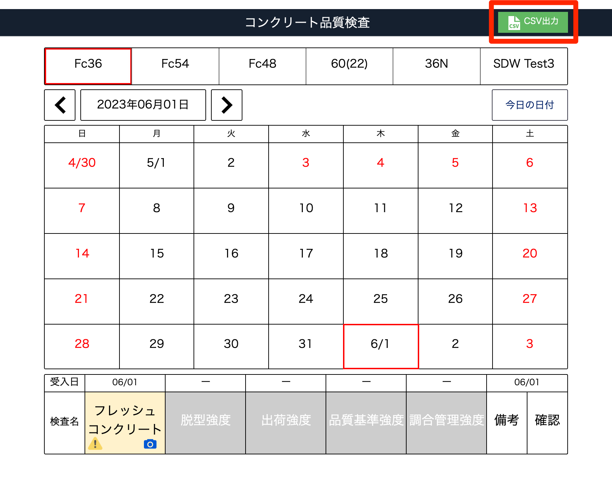
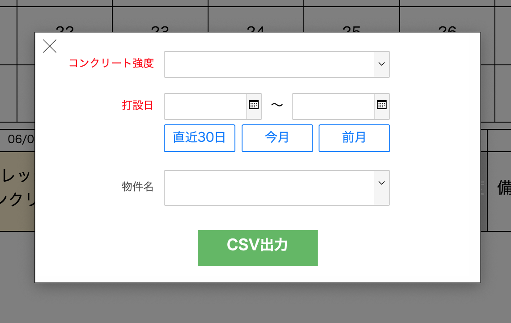

# CSV出力する

### 指定した期間に打設したコンクリート強度種の検査結果、及びそれに紐づく製品のデータを出力します。

 
1. [コンクリート品質検査]画面から「CSV出力」をクリックします。

    <table><tr><td>
    
    </td></tr></table>

1. 以下の項目から出力するデータを指定し「CSV出力」をクリックします。

    - コンクリート強度（必須）
    - 打設日（必須）
    - 物件名

    <table><tr><td>
    
    </td></tr></table>

1. 指定した出力先に、CSVファイルが出力されます。

    ファイル名：コンクリート検査集計_[コンクリート強度]_[打設日]

    コンクリート受入日と製品の打設完了予定日を照合し、[コンクリート強度略称]と製品の[配合1or2)]が一致する製品の[製品番号]、製品を使用する[物件名称]が表示されます。

    一致例)  
    コンクリート品質検査  受入日：6/1  
    コンクリート強度略称：高強度80-55    
    製品 打設完了予定日：6/1  
    配合1：高強度80-55  
    物件名称：〇〇工事
