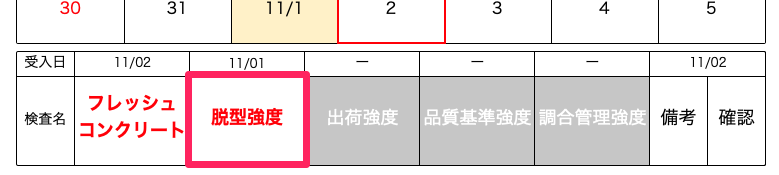
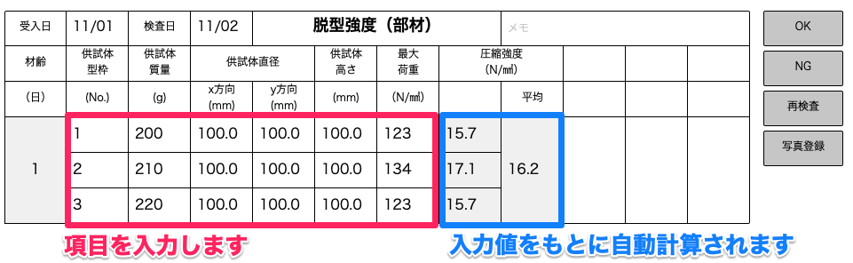
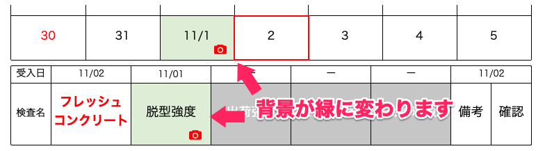

# 脱型強度検査をする

### コンクリート受入日（フレッシュコンクリート検査日）の翌日（休日の場合は翌稼働日）に脱型強度検査を行います。

 
1. コンクリート強度を選択します。

    <table><tr><td>
    
    </td></tr></table>

1. 下の表から「脱型強度」を選択します。

    <table><tr><td>
    
    </td></tr></table>

1. 検査項目を入力します。

    <table><tr><td>
    
    </td></tr></table>

1. 検査結果が「OK」か「NG」かを選択します。

1. 「確定」を選択します。

1. カレンダーのフレッシュコンクリート検査日と下の表の脱型強度の欄が緑色に変わります。

    <table><tr><td>
    
    </td></tr></table>

同様に出荷強度検査、品質基準強度検査、調合管理強度検査を行います。  
各検査の日付は[フレッシュコンクリート検査]()画面からも確認できます。