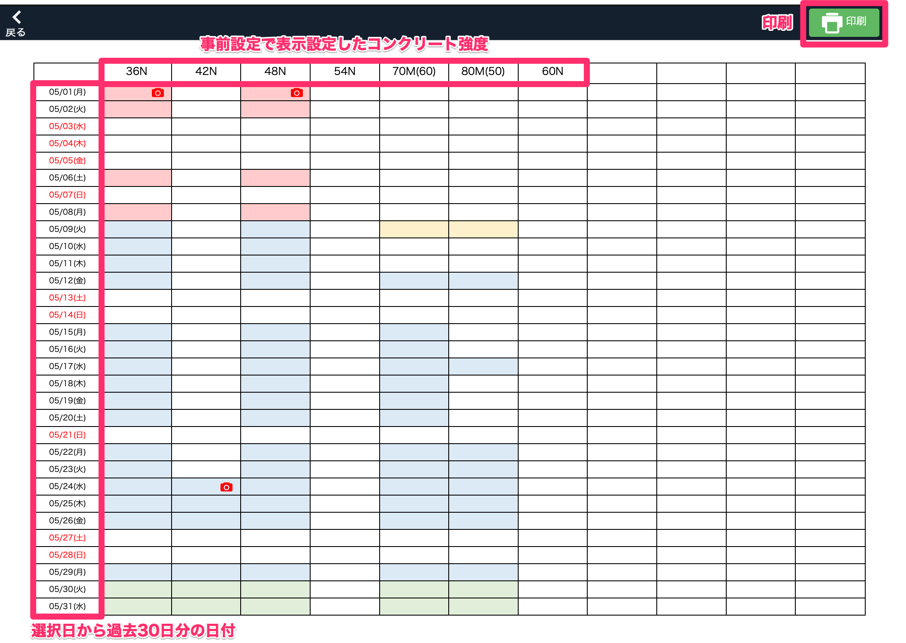

# コンクリート品質検査画面を表示する

 
1. 「品質管理システム」トップ画面から「コンクリート品質管理」を選択します。

    <table><tr><td>
    
    </td></tr></table>

1. [コンクリート品質管理]画面が表示されます。

    <table><tr><td>
    
    </td></tr></table>

 
### 各項目詳細

1. コンクリート強度  
    [コンクリート強度マスタ]で表示設定がされている項目のみ表示され、ここから強度を選択することができます。

1. 今日の日付  
    クリックすると、今日の日付に移動することができます。

1. 日付の切り替え
    日付を切り替えることができます。

1. カレンダー
    選択した日付から過去4週間分のカレンダーが表示されます。  
    デフォルトで今日の日付が選択されており、赤枠で表示されます(上図では10/6)。

1. 検査名・状況  
    選択日に行う検査名と検査状況が表示されます。

1. 備考
    写真を登録することができます。

1. 確認
    指定した日付から過去30日分の検査状況を表形式で確認することができます。  
    右上の「印刷」ボタンから表の印刷も可能です。

1. CSV出力
    [コンクリート強度]、[打設日]、[物件名]を指定して、CSV出力することができます。

<table><tr><td>

</td></tr></table>
