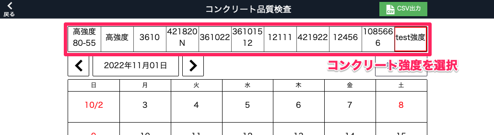
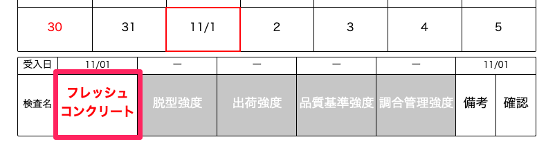
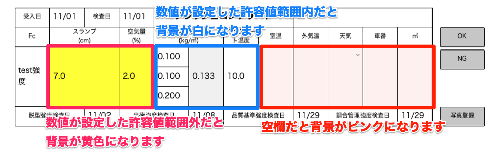
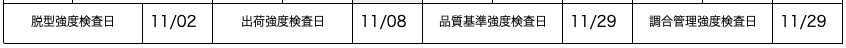
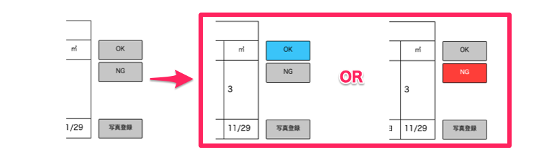
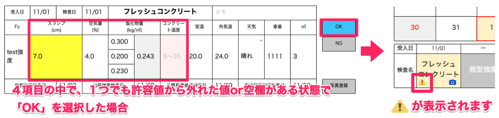
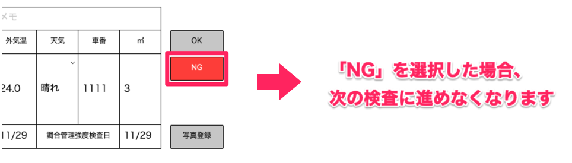
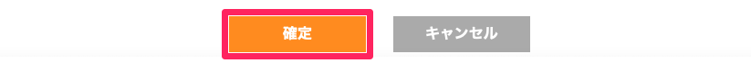
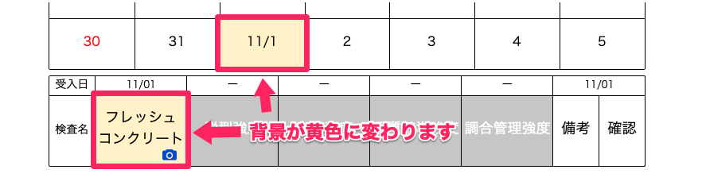

# フレッシュコンクリート検査をする

### コンクリート受入日にフレッシュコンクリート検査を行います。

 
1. コンクリート強度を選択します。

    <table><tr><td>
    
    </td></tr></table>

1. 画面左下の表の「フレッシュコンクリート」を選択します。

    <table><tr><td>
    
    </td></tr></table>

1. 検査項目を入力します。

    <table><tr><td>
    
    </td></tr></table>

    また、以降の検査の日付を  
    [脱型強度検査日]、  
    [出荷強度検査日]、  
    [品質基準強度検査日]、  
    [調合管理強度検査日]項目で確認できます。
    <table><tr><td>
    
    </td></tr></table>

    {: .warning }
    メモ欄は各検査で共有されます。

1. 検査結果が「OK」か「NG」かを選択します。

    <table><tr><td>
    
    </td></tr></table>

    - 補足

        「OK」
        <table><tr><td>
        
        </td></tr></table>

        「NG」
        <table><tr><td>
        
        </td></tr></table>

1. 「確定」を選択します。

    <table><tr><td>
    
    </td></tr></table>

1. カレンダーと下の表のフレッシュコンクリートの欄が黄色に変わります。

    <table><tr><td>
    
    </td></tr></table>