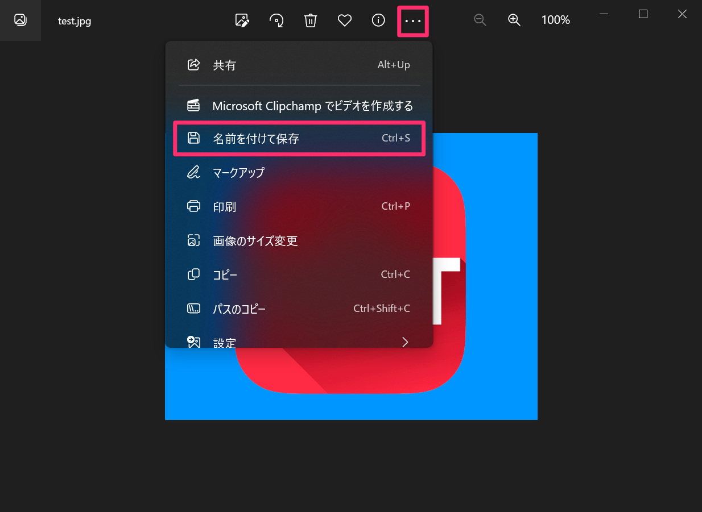

# 登録済の写真を取り込む

 

Windowsの場合

 
1. 登録した写真の右下の拡大表示アイコンをクリックします。
 
    <table><tr><td>
    
    </td></tr></table>
 
 

2.  「フォト」アプリが起動します。画面上の「…」アイコンをクリックし、「名前を付けて保存」を選択します。
 
    <table><tr><td>
    
    </td></tr></table>
 
 

3. 保存先を選択します。
 
 

iPadの場合

 
1. 登録した写真の右下の拡大表示アイコンをタップします。
 
    <table><tr><td>
    
    </td></tr></table>
 
 

2. 画面右上の共有アイコンをタップします。
 
    <table><tr><td>
    
    </td></tr></table>
 
 

3. “ファイル”に保存をタップします。
 
    <table><tr><td>
    
    </td></tr></table>
 
 

