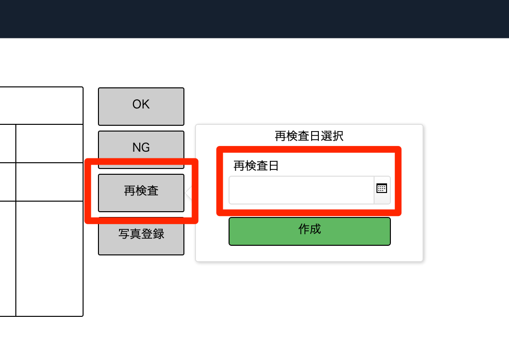
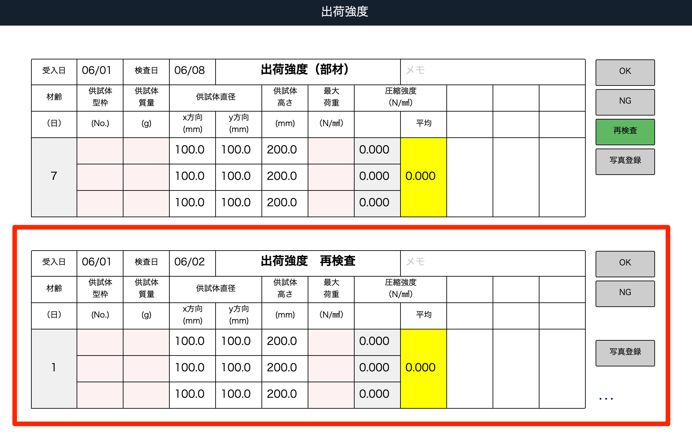
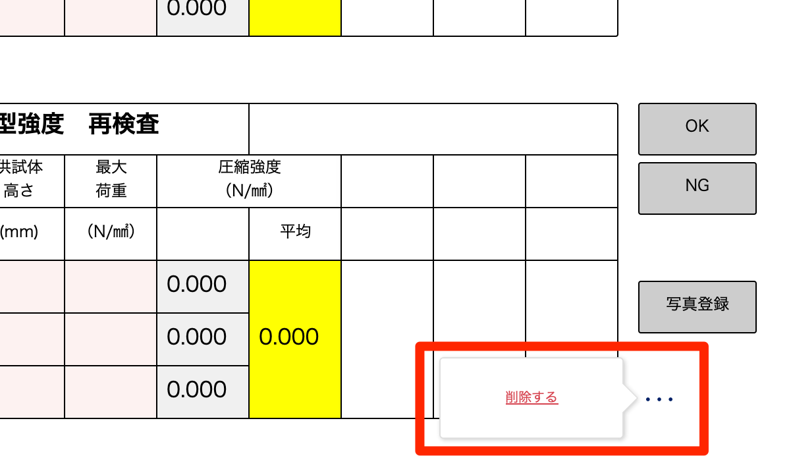

# 再検査をする（脱型、出荷のみ）

 
1. 検査画面内の「再検査」ボタンをクリックし、再検査日を入力します。

    <table><tr><td>
    
    </td></tr></table>

1. 「作成」ボタンをクリックすると、再検査用の検査項目が作成されます。

    <table><tr><td>
    
    </td></tr></table>

    再検査項目は「…」ボタンから削除することが可能です。

    <table><tr><td>
    
    </td></tr></table>