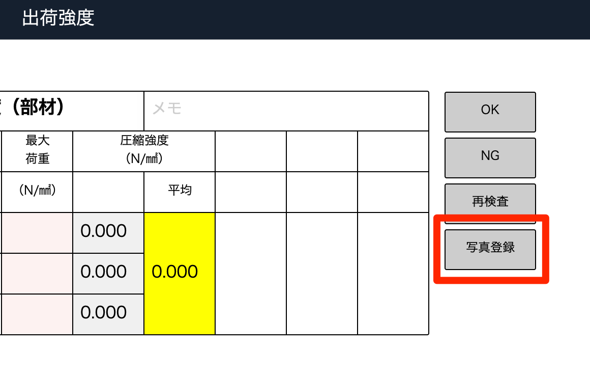
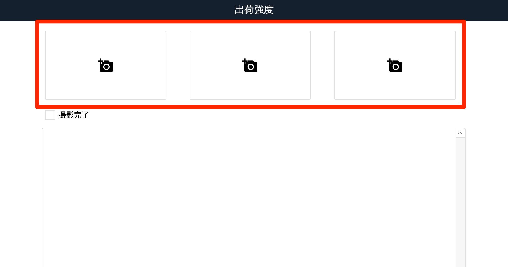
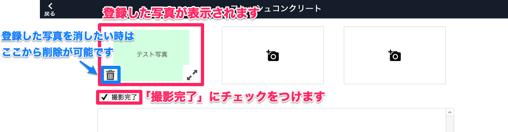
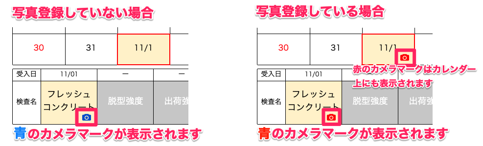
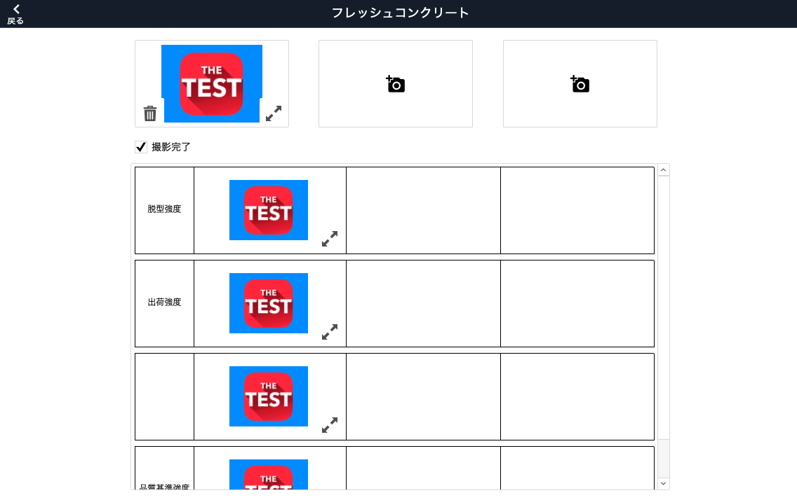

# 写真登録をする（iPad）

 
1. 各検査項目入力画面内の「写真登録」、または[コンクリート品質検査]画面内の「備考」をタップします。

    <table><tr><td>
    
    </td></tr></table>

1. カメラアイコンをタップするとカメラが起動しますので、撮影し「写真を使用」をタップします。

    <table><tr><td>
    
    </td></tr></table>

1. 写真が登録されたことを確認し「撮影完了」にチェックをつけます。

    <table><tr><td>
    
    </td></tr></table>

 
- 補足

    <table><tr><td>
    
    </td></tr></table>

    各検査で画像を登録すると下の欄に表示されます。

    <table><tr><td>
    
    </td></tr></table>

{: .warning }
写真撮影はiPadのみの機能です。