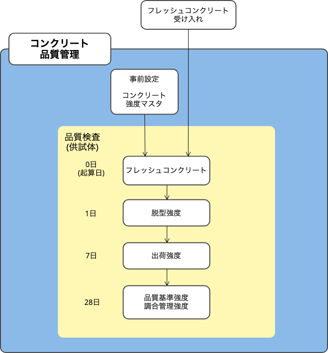
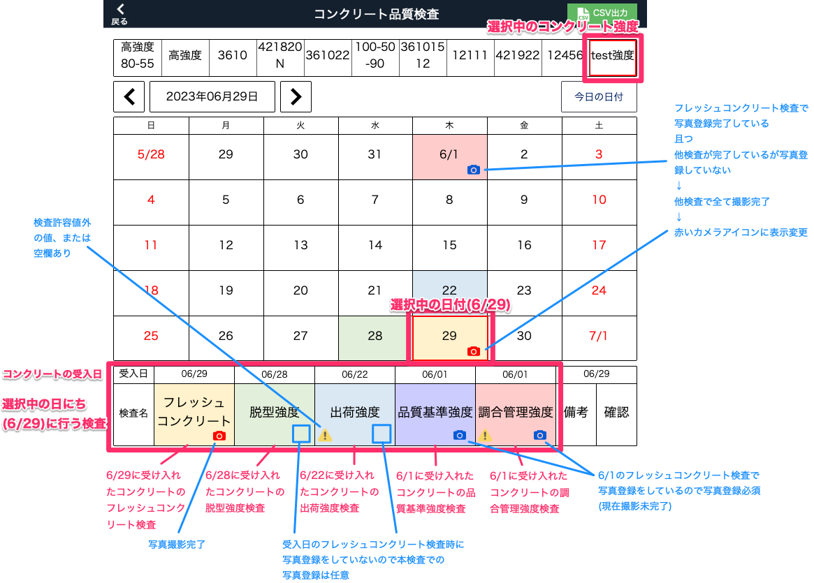
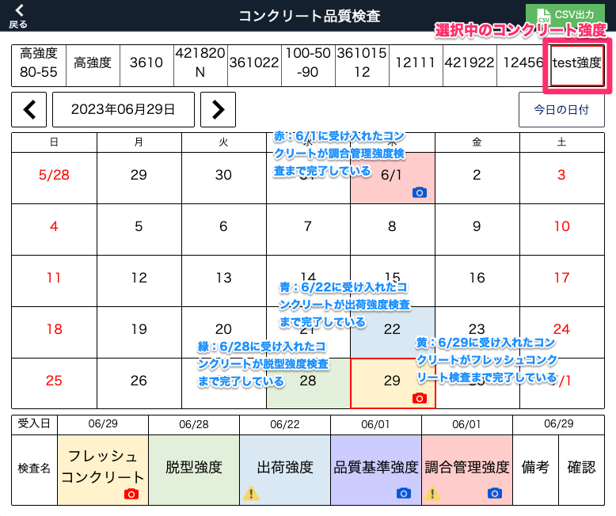

# コンクリート品質管理

### フロー図

 
<table><tr><td>

</td></tr></table>

 
### 画面概要

 
- 休日は赤文字で表示されます。
- カレンダーには選択中のコンクリート強度の検査状況が表示されます。
- 各日で受け入れたコンクリートの最新の検査状況が色別で表示されます。

    黄：フレッシュコンクリート検査済

    緑：脱型強度検査OKまたはNG(再検査中の場合、色変更されません)

    青：出荷検査OKまたはNG(再検査中の場合、色変更されません)

    紫：品質基準検査済

    赤：調合管理検査済

- 検査項目に注意点がある場合以下のアイコンが表示されます。
    1. 「！」アイコン：検査項目に検査許容値外の値または空欄がある
    1. 「カメラ」アイコン（青）： 写真未登録、写真登録が必要
    1. 「カメラ」アイコン（赤）：写真撮影未完了

 
例）コンクリート強度：test強度、日付：6/29を選択

<table><tr><td>

</td></tr></table>

<table><tr><td>

</td></tr></table>