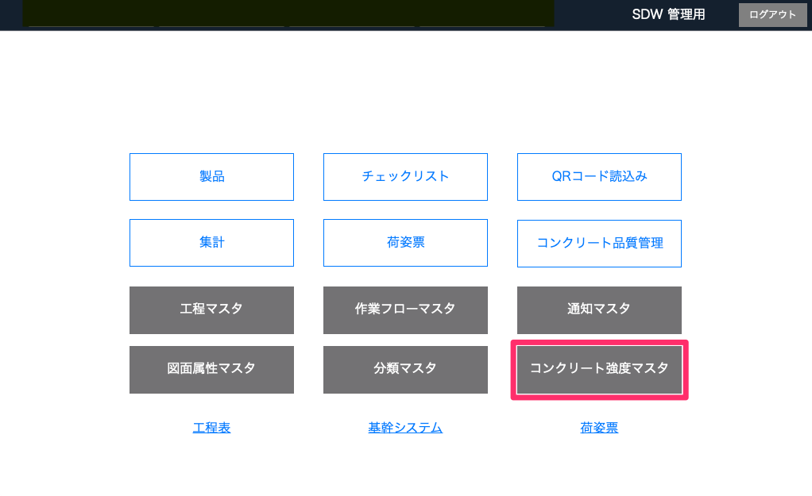
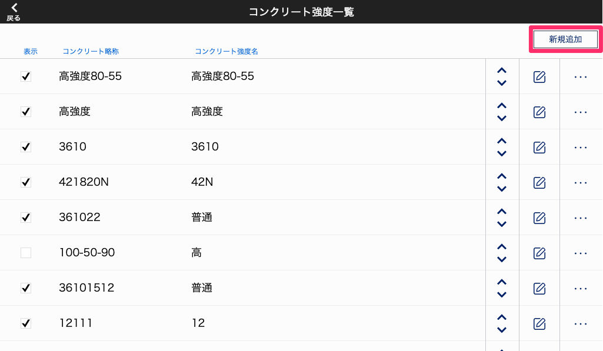
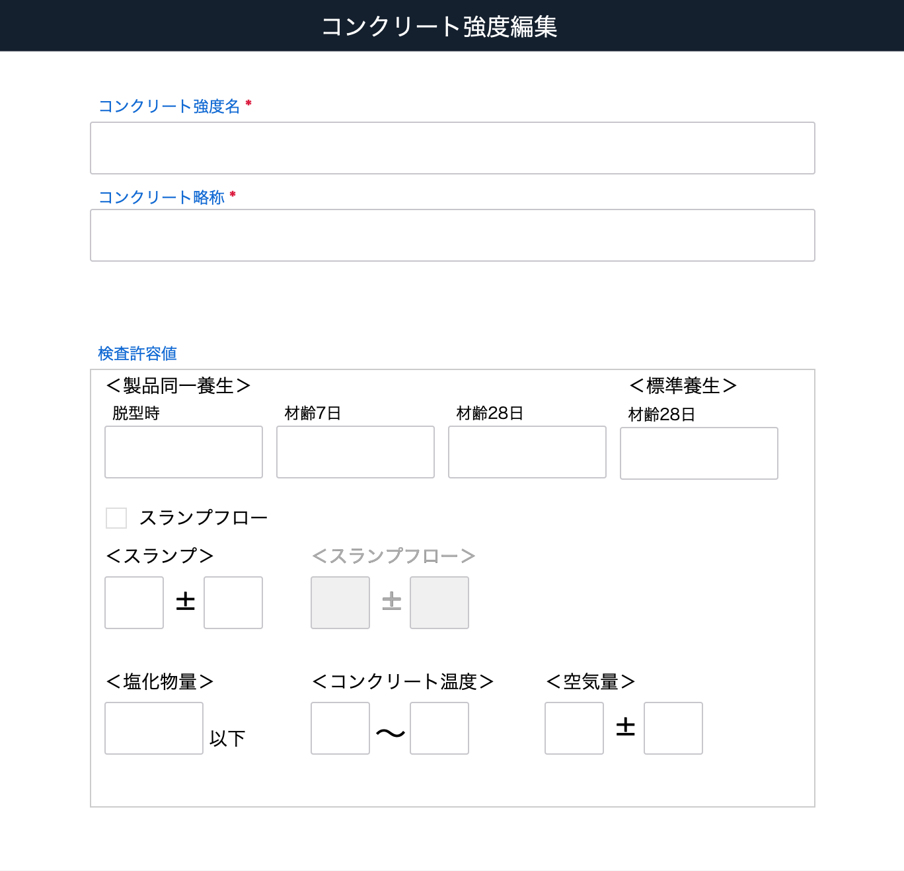

# コンクリート強度マスタの登録

 
1. 「品質管理システム」トップ画面から「コンクリート強度マスタ」を選択します。

    <table><tr><td>
    
    </td></tr></table>

1. [コンクリート強度一覧]画面から「新規追加」を選択します。

    <table><tr><td>
    
    </td></tr></table>

1. コンクリート強度の情報を入力し「確定」ボタンをクリックします。  
    検査許容値は、コンクリート品質検査時の判定に使用されます。
    <table><tr><td>
    
    </td></tr></table>

    | 設定項目             | 検査                | 検査項目 | 
    | ------------------- | ------------------ | -------- | 
    | 脱型時（製品同一養生）  | 脱型強度            | 圧縮強度 | 
    | 材齢7日（製品同一養生） | 出荷強度            | 圧縮強度 | 
    | 材齢28日（製品同一養生）| 品質基準強度         | 圧縮強度 | 
    | 材齢28日（標準養生）   | 調合管理強度         | 圧縮強度 | 
    | スランプ（cm）        | フレッシュコンクリート |         | 
    | スランプフロー        | フレッシュコンクリート |         | 
    | 塩化物量（kg/㎥）     | フレッシュコンクリート |         | 
    | コンクリート温度      | フレッシュコンクリート |         | 
    | 空気量（%）          | フレッシュコンクリート |         | 

1. コンクリート品質検査時、[製品登録時（配合項目）]()に項目を選択できるようになります。