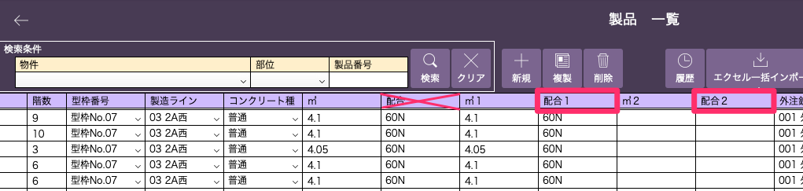
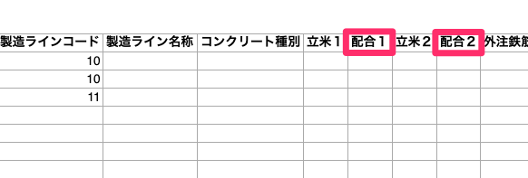

# 製品登録

### コンクリート品質管理をする上で必要な情報を「製品マスタ」に登録します。

 
1. [製品マスタの登録]()を参考に製品情報を編集します。

    製品情報の編集画面に移動します。  
    基幹システム：製品 > 製品一覧(情報追加したい製品を選択) > 編集  
    または[項目内容]()を更新するエクセルファイルを開きます。

1. 以下の項目を追記します。
    - 配合1（複数の配合を含む製品の場合、配合2も記入）  
    CSV出力をする際に、打設日を元にコンクリート品質検査をした配合と製品が紐づけられます。

<table><tr><td>

</td></tr></table>

<table><tr><td>

</td></tr></table>

{: .warning }
※ [配合]項目は㎥1、2を元に自動計算される項目のため入力しないでください。