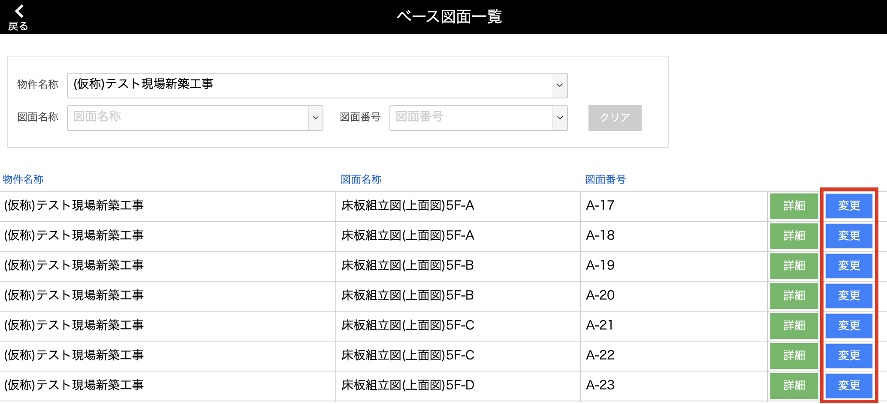
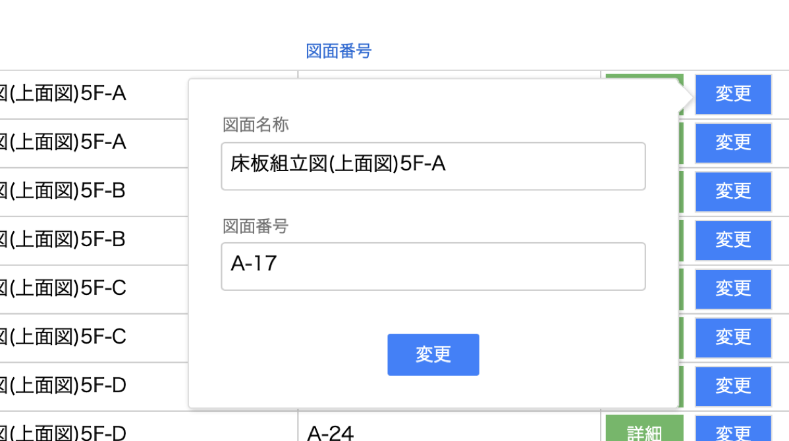

# [図面名称]、[図面番号]を変更する

 

1. [品質管理システム]トップ画面から「ベース図面」を選択します。

    <table><tr><td>
    
    </td></tr></table>

2. 変更を行いたいベース図面の「変更」をクリックします。

    <table><tr><td>
    
    </td></tr></table>

3. 変更する項目を入力し、「変更」をクリックすることで完了します。

    <table><tr><td>
    
    </td></tr></table>

    {: .warning }
    空白での変更はできません。