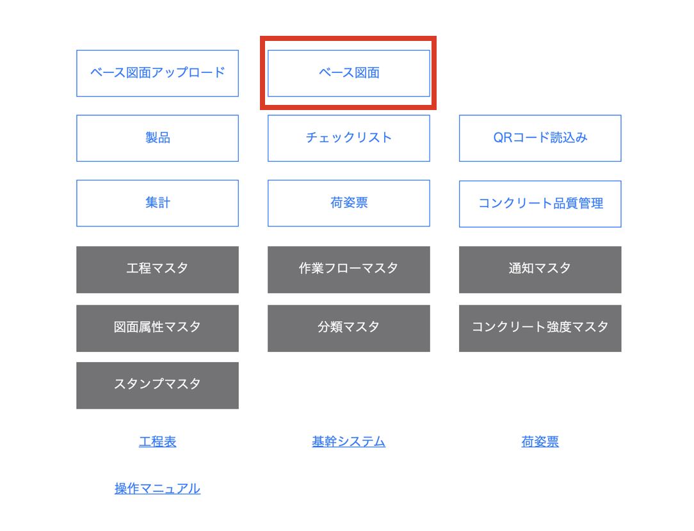
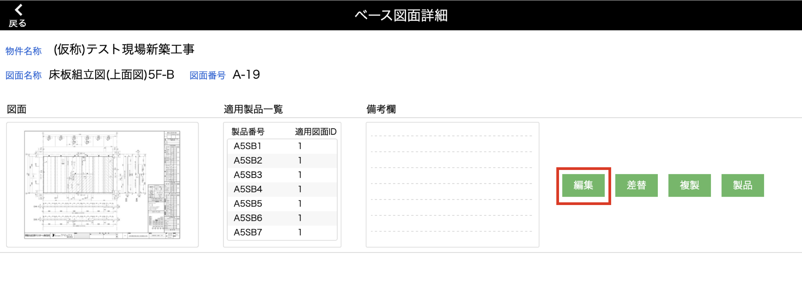
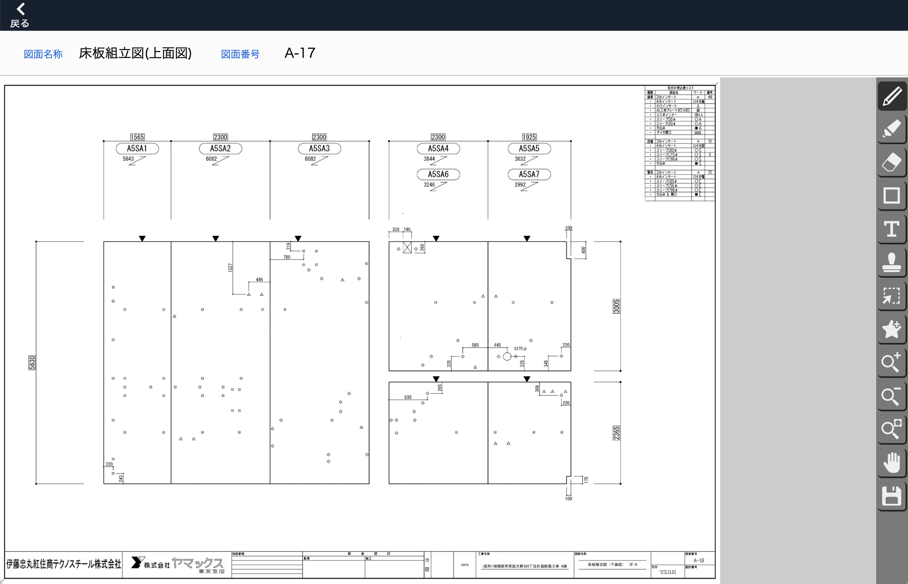
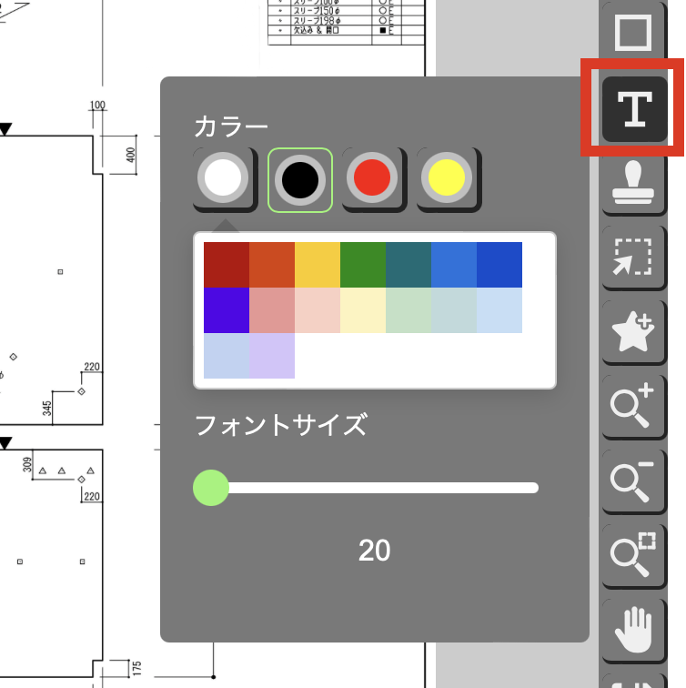
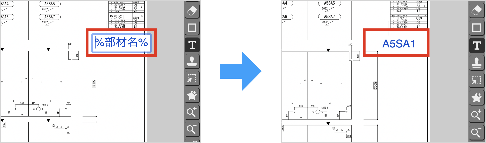
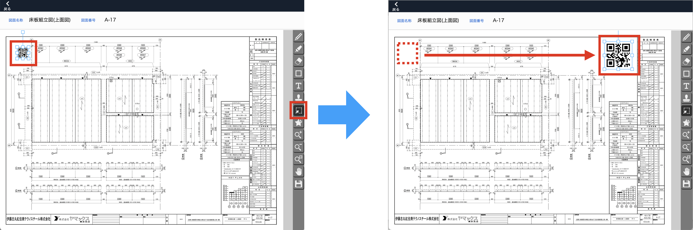

# ベース図面に共通の描き込みをする
### ベース図面に描き込んだ内容は、ベース図面を適用している製品の図面に共通で表示されます。

 

{: .note }
製品登録後にベース図面に描き込みを行った場合でも、描き込み内容は反映されます。

1. [品質管理システム]トップ画面から「ベース図面」を選択します。

    <table><tr><td>
    
    </td></tr></table>

1. [ベース図面一覧]画面で共通描き込みしたいベース図面の「詳細」をクリックします。

    <table><tr><td>
    
    </td></tr></table>

1. 描き込みを行いたいベース図面の「編集」をクリックします。

    <table><tr><td>
    
    </td></tr></table>

1. 共通描き込み画面が表示されます。

    <table><tr><td>
    
    </td></tr></table>

<!--   -->
## ツール

### 下記のツール以外の仕様は、[個別描き込み]()と同じです。

- 動的テキストボックス  

    [製品番号(部材名)]と[階数]を、製品に合わせて動的に表示する機能が使用できます。  

    1. テキストボックスで、テキストの色と太さを指定します。

        <table><tr><td>
        
        </td></tr></table>

    2. テキストボックスに下表を参考に文字を記入すると、製品に合わせて動的に表示されます。

        | 表示する対象 | 記入する文字 | 
        | ------------ | ------------ | 
        | 製品番号     | %部材名%      | 
        | 階数         | %階数%       | 

        <table><tr><td>
        
        </td></tr></table>

{: .note }
道的テキストの前後に文字をすることも可能です。  
例）%階数%階  →　3階

{: .warning }
図面の印刷を行う場合は、一度、個別の図面手描き機能画面で保存しないと動的テキストが表示されません。

- QRコード位置指定   

    チェックリスト表示用のQRコードを表示する位置を指定することができます。

    <!-- <table><tr><td>
    
    </td></tr></table> -->
