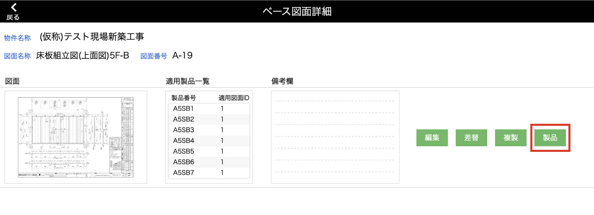
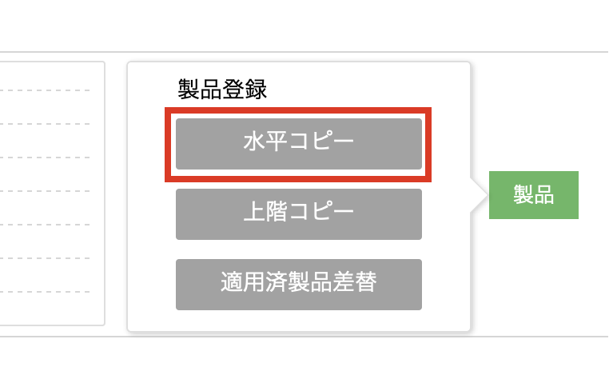
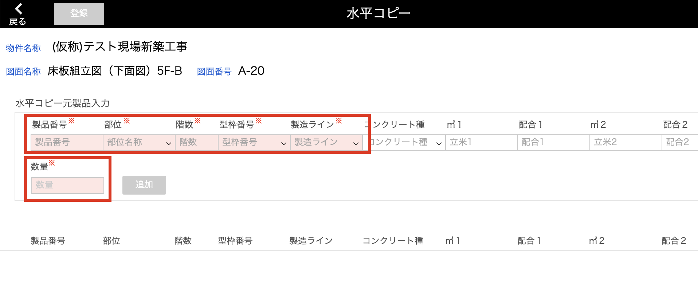
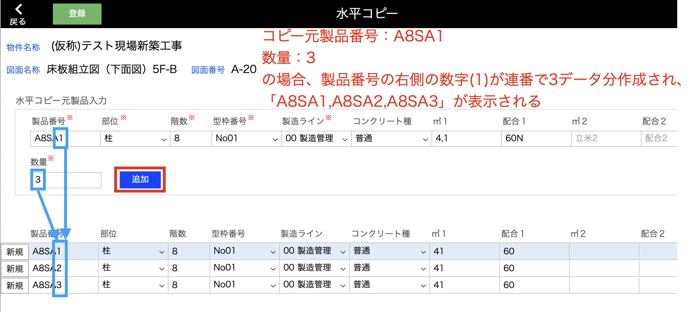
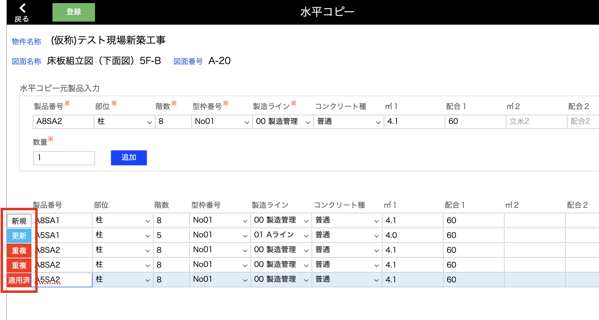
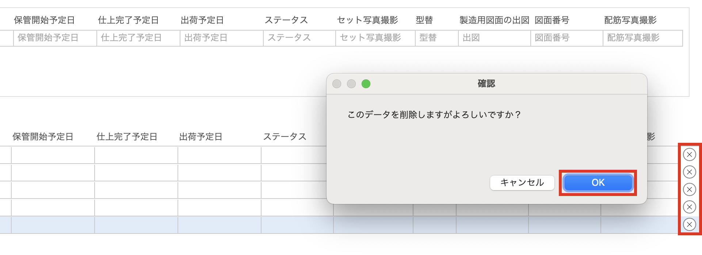
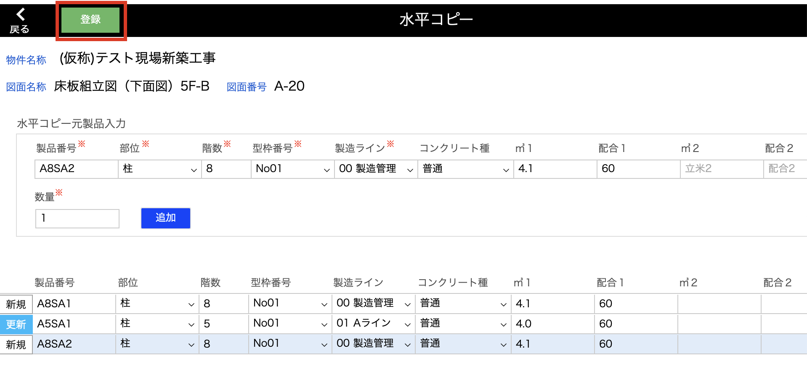

# 製品の水平コピーをする
### 任意のベース図面を適用する製品番号を連番で登録します。

 

{: .warning }
同じ図面名称、図面番号のベース図面がすでに登録されている製品は登録できません。  
ベース図面の差し替えは[適用済製品差替]()画面から行ってください。

1. [品質管理システム]トップ画面から「ベース図面」を選択します。

    <table><tr><td>
    
    </td></tr></table>

2. [ベース図面一覧]画面で製品登録したいベース図面の「詳細」をクリックします。

    <table><tr><td>
    
    </td></tr></table>

3. 「製品」をクリックするとポップアップが表示されます。

    <table><tr><td>
    
    </td></tr></table>

4. 3パターンの製品登録方法が表示されます。「水平コピー」をクリックします。

    <table><tr><td>
    
    </td></tr></table>

5. [水平コピー元製品入力]欄に、水平コピーしたい製品情報を入力します。(赤枠必須項目)  

    <table><tr><td>
    
    </td></tr></table>

    {: .note }  
    すでに存在する[製品番号][部位名称]をベース図面登録対象に追加する場合は、入力した内容ではなく既存製品情報が表示されます。  

6. 「追加」をクリックで、設定した数量分の製品が複製されます。  
    製品番号は右に位置する数字が連番で生成されます。

    <table><tr><td>
    
    </td></tr></table>

    {: .note } 
    製品情報はこの画面上で手動変更が可能です。

    - **ステータス**  
    ４パターンのステータスがあります。  

    <table><tr><td>
    
    </td></tr></table>

    | ステータス | 登録可否 | 詳細                                         | 
    | ---------- | -------- | -------------------------------------------- | 
    | 新規       | ○       | 製品を新規作成し、ベース図面を適用する                                 | 
    | 更新     | ○ | 既存の製品にベース図面を適用する           | 
    | 重複      | × | 登録対象一覧に同じ製品番号のデータが複数ある | 
    | 適用済    | × | すでに同じベース図面が登録されている        | 

    - **削除**  
    右端までスクロールすると「×」があるので、このボタンから削除が可能です。  
    全ての一覧を削除したい場合は、一度前画面に戻ることでリセットされます。

    <table><tr><td>
    
    </td></tr></table>

7. 登録したい製品を一覧に追加したら、「登録」をクリックでベース図面を適用する製品の登録が完了します。 

    <table><tr><td>
    
    </td></tr></table>

    {: .warning }  
    登録対象の一覧に[重複][適用済]ステータスのデータがある場合は登録できません。