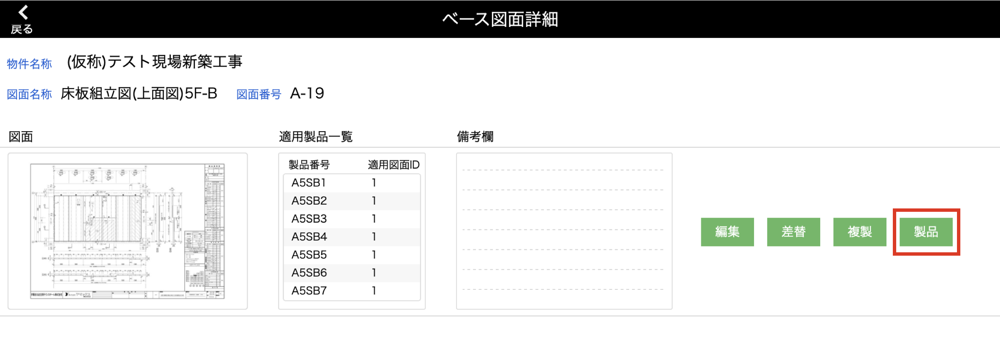

# 適用済のベース図面を差し替える
### ベース図面の差替を行った後に、どの製品を差し替え対象とするか選択して登録します。

 

{: .warning }
この機能は同じ図面名称、図面番号のベース図面が複数ある場合のみ使用できます。  
適用済製品差替機能を使うには、先に[ベース図面の複製]()を行ってください。

1. [品質管理システム]トップ画面から「ベース図面」を選択します。

    <table><tr><td>
    
    </td></tr></table>

2. [ベース図面一覧]画面で製品登録したいベース図面の「詳細」をクリックします。

    <table><tr><td>
    
    </td></tr></table>

3. 「製品」をクリックするとポップアップが表示されます。

    <table><tr><td>
    
    </td></tr></table>

4. 3パターンの製品登録方法が表示されます。「適用済製品差替」をクリックします。

    <table><tr><td>
    
    </td></tr></table>

5. [適用済製品一覧]に、同じ図面名称、図面番号のベース図面が登録されている製品の一覧が表示されます。  
    [適用済製品一覧]から、ベース図面を差し替えたい製品を選んで✔️をつけます。

    <table><tr><td>
    
    </td></tr></table>

    - **検索**  
    [適用済製品一覧]を階数などの検索条件で絞り込むことが可能です。

    <table><tr><td>
    
    </td></tr></table>

6. 「差替」をクリックで、✔️をつけた製品が登録対象の一覧に表示されます。  

    <table><tr><td>
    
    </td></tr></table>

    {: .warning } 
    製品情報はこの画面上では変更できません。変更は[製品情報の変更]()を参考に行ってください。

    - **ステータス**  
    2パターンのステータスがあります。  

    <table><tr><td>
    
    </td></tr></table>

    | ステータス | 登録可否 | 詳細                                         | 
    | ---------- | -------- | -------------------------------------------- | 
    | 更新     | ○ | 既存の製品にベース図面を適用する           | 
    | 重複      | × | 登録対象一覧に同じ製品番号のデータが複数ある | 

    - **削除**  
    右端までスクロールすると「×」があるので、このボタンから削除が可能です。  
    全ての一覧を削除したい場合は、一度前画面に戻ることでリセットされます。

    <table><tr><td>
    
    </td></tr></table>

7. 差し替えたい製品を一覧に追加したら、「登録」をクリックでベース図面を適用する製品の登録が完了します。 

    <table><tr><td>
    
    </td></tr></table>

    {: .warning }  
    登録対象の一覧に[重複]ステータスのデータがある場合は登録できません。