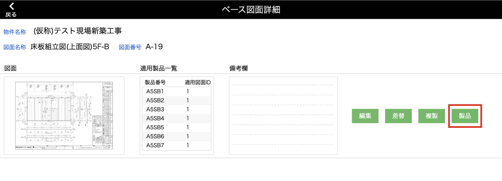
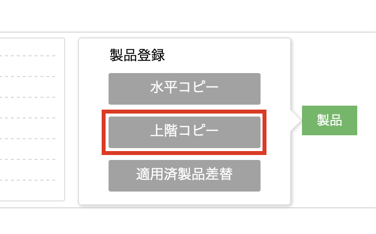
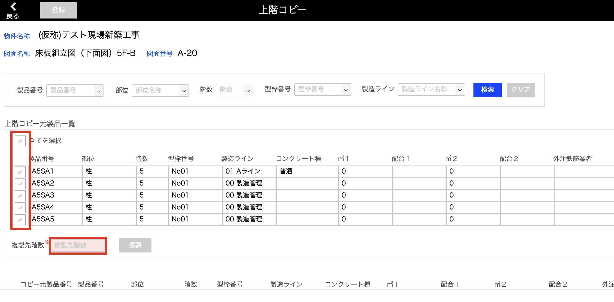
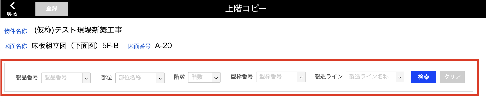
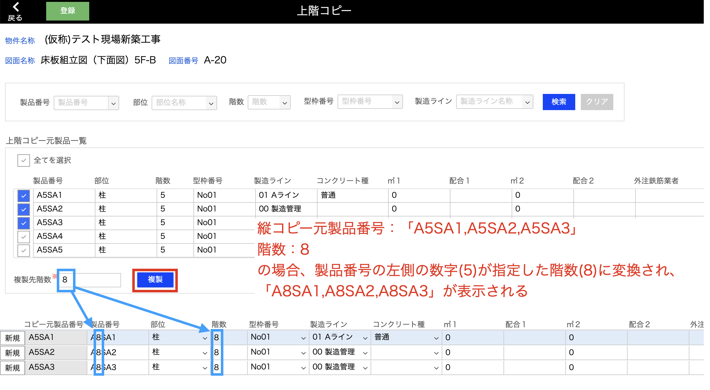
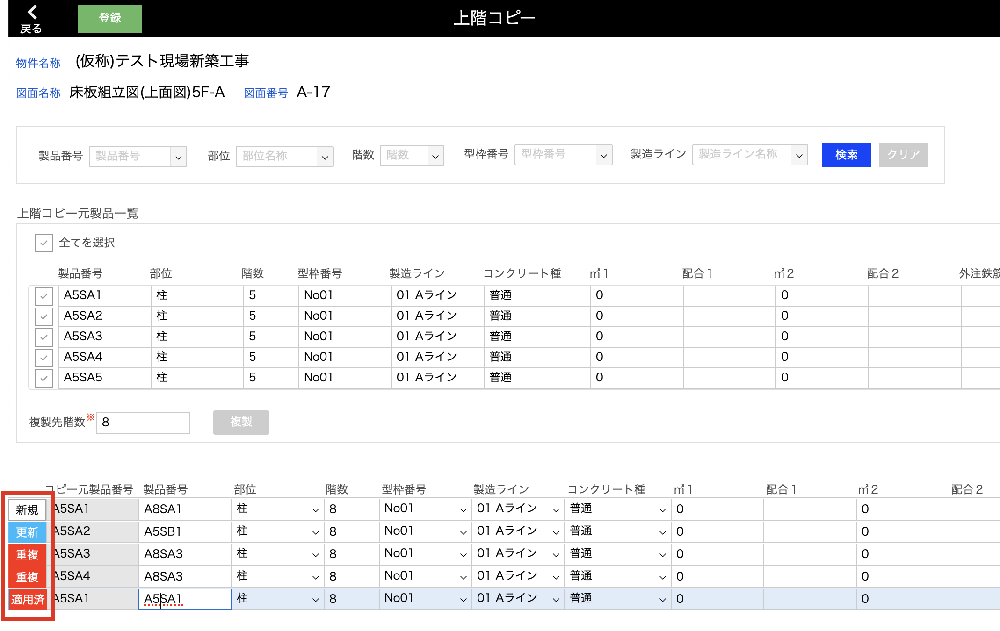
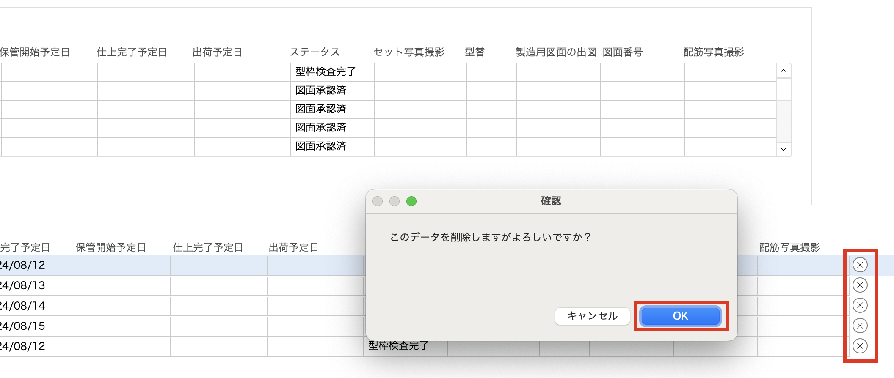
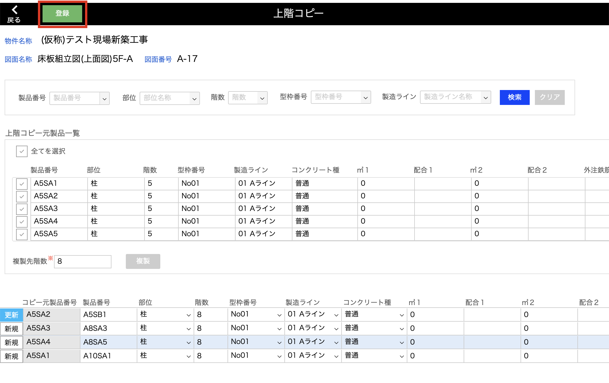

# 製品を上階へコピーする
### すでに同じベース図面が登録されている製品情報を複製し、階数のみ変更して登録します。

 

{: .note }
上階コピー時点で、複製元製品に個別の図面描き込みが行われていた場合は、その内容も複製されます。

{: .warning }
同じ図面名称、図面番号のベース図面がすでに登録されている製品は登録できません。  
ベース図面の差し替えは[適用済製品差替]()画面から行ってください。

1. [品質管理システム]トップ画面から「ベース図面」を選択します。

    <table><tr><td>
    
    </td></tr></table>

2. [ベース図面一覧]画面で製品登録したいベース図面の「詳細」をクリックします。

    <table><tr><td>
    
    </td></tr></table>

3. 「製品」をクリックするとポップアップが表示されます。

    <table><tr><td>
    
    </td></tr></table>

4. 3パターンの製品登録方法が表示されます。「上階コピー」をクリックします。

    <table><tr><td>
    
    </td></tr></table>

5. [上階コピー元製品一覧]に、同じベース図面が登録されている製品一覧が複製元として表示されます。  
    登録する製品の階数を入力し、[上階コピー元製品一覧]から複製したい製品を選んで✔️をつけます。

    <table><tr><td>
    
    </td></tr></table>

    - **検索**  
    [上階コピー元製品一覧]を階数などの検索条件で絞り込むことが可能です。

    <table><tr><td>
    
    </td></tr></table>

    {: .note }  
    すでに存在する[製品番号][部位名称]をベース図面登録対象に追加する場合は、入力した内容ではなく既存製品情報が表示されます。  

6. 「複製」をクリックで、指定した階数で[製品番号]と[階数]が変更された製品が表示されます。  

    <table><tr><td>
    
    </td></tr></table>

    {: .note } 
    製品情報はこの画面上で手動変更が可能です。

    - **ステータス**  
    ４パターンのステータスがあります。  

    <table><tr><td>
    
    </td></tr></table>

    | ステータス | 登録可否 | 詳細                                         | 
    | ---------- | -------- | -------------------------------------------- | 
    | 新規       | ○       | 製品を新規作成し、ベース図面を適用する                                 | 
    | 更新     | ○ | 既存の製品にベース図面を適用する           | 
    | 重複      | × | 登録対象一覧に同じ製品番号のデータが複数ある | 
    | 適用済    | × | すでに同じベース図面が登録されている        | 

    - **削除**  
    右端までスクロールすると「×」があるので、このボタンから削除が可能です。  
    全ての一覧を削除したい場合は、一度前画面に戻ることでリセットされます。

    <table><tr><td>
    
    </td></tr></table>

7. 登録したい製品を一覧に追加したら、「登録」をクリックでベース図面を適用する製品の登録が完了します。 

    <table><tr><td>
    
    </td></tr></table>

    {: .warning }  
    登録対象の一覧に[重複][適用済]ステータスのデータがある場合は登録できません。