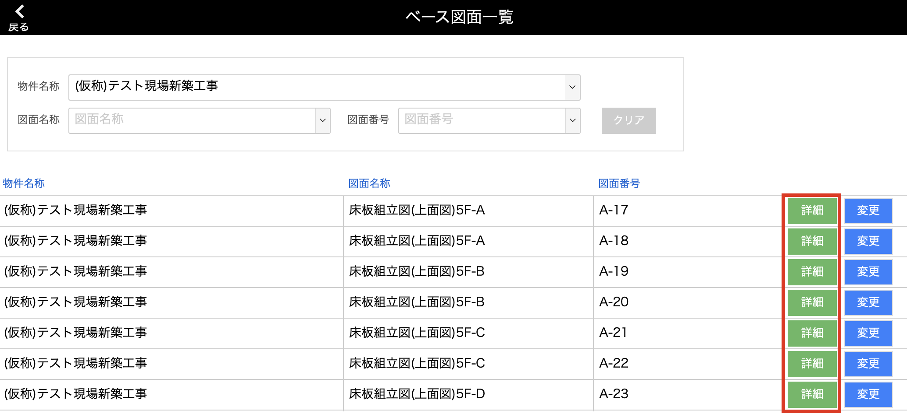
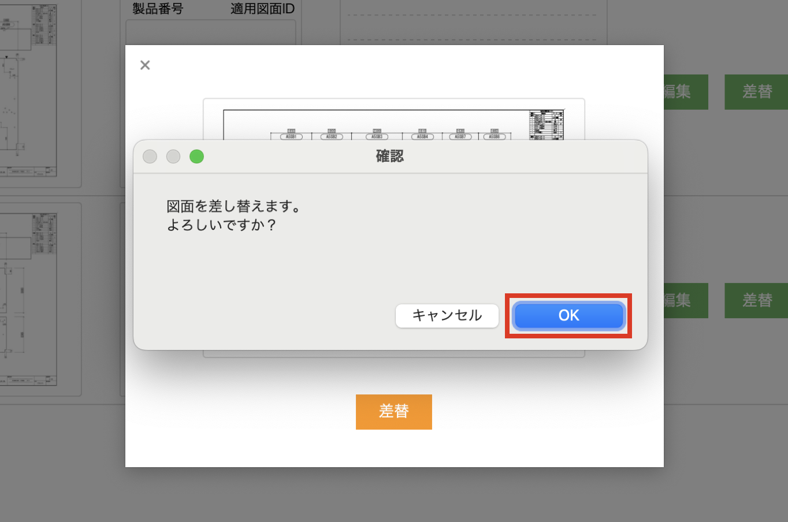

# ベース図面の差替を行う

 

{: .note }  
ベース図面の差替を行なっても、差替前の共通の描き込み内容は消えずに残ります。  

1. [品質管理システム]トップ画面から「ベース図面」を選択します。

    <table><tr><td>
    
    </td></tr></table>

2. [ベース図面一覧]画面で、図面を差し替えたいベース図面の「詳細」をクリックします。

    <table><tr><td>
    
    </td></tr></table>

3. 差し替えたいベース図面の「差替」をクリックします。

    <table><tr><td>
    
    </td></tr></table>

4. 差し替える図面をアップロードします。

    <table><tr><td>
    
    </td></tr></table>

5. 図面をアップしたら「差替」をクリックします。

    <table><tr><td>
    
    </td></tr></table>

6. 確認メッセージが表示されるので、「OK」をクリックしたら差替完了です。

    <table><tr><td>
    
    </td></tr></table>
