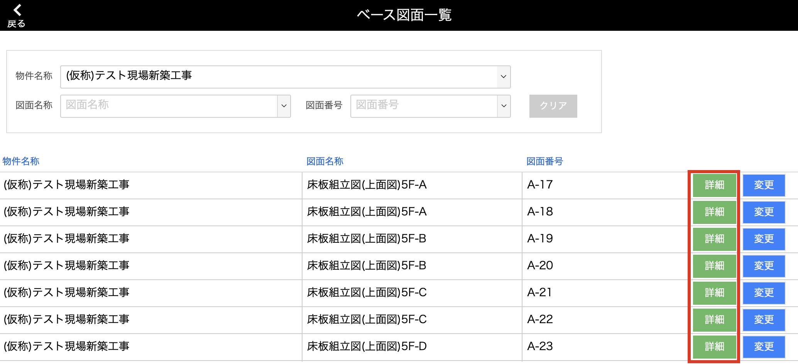
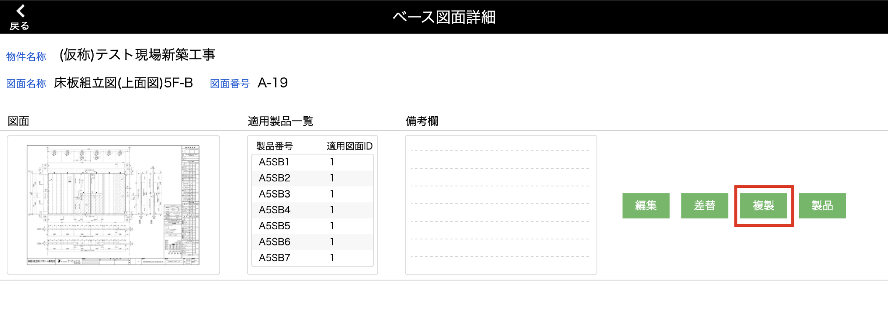
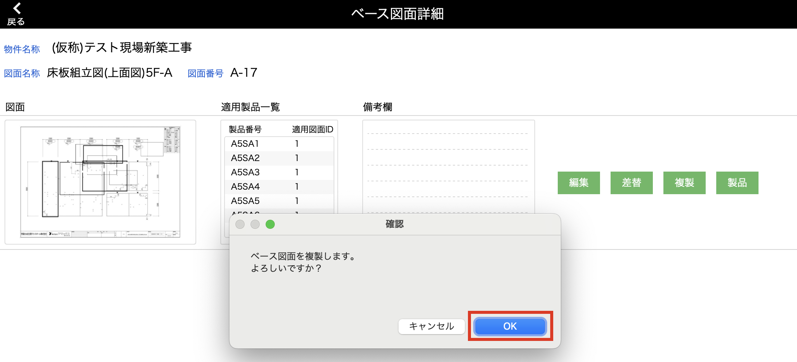
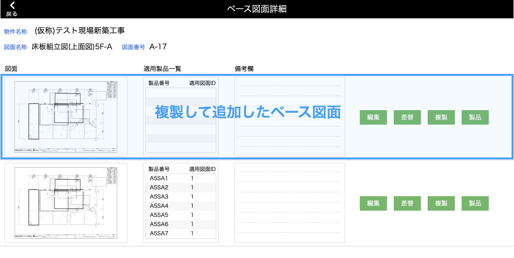

# ベース図面を複製する
### ベース図面に登録している[図面]と[描き込み内容]を複製します。

 

1. [品質管理システム]トップ画面から「ベース図面」を選択します。

    <table><tr><td>
    
    </td></tr></table>

2. [ベース図面一覧]画面で複製したいベース図面の「詳細」をクリックします。

    <table><tr><td>
    
    </td></tr></table>

3. 複製したいベース図面の「複製」をクリックします。

    <table><tr><td>
    
    </td></tr></table>

4. 確認メッセージが表示されるので、「OK」をクリックしたら複製完了です。  
    
    <table><tr><td>
    
    </td></tr></table>

5. 複製したベース図面は一覧の一番上に表示されます。  

    <table><tr><td>
    
    </td></tr></table>
