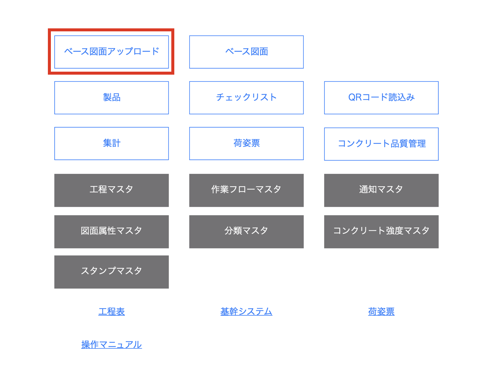
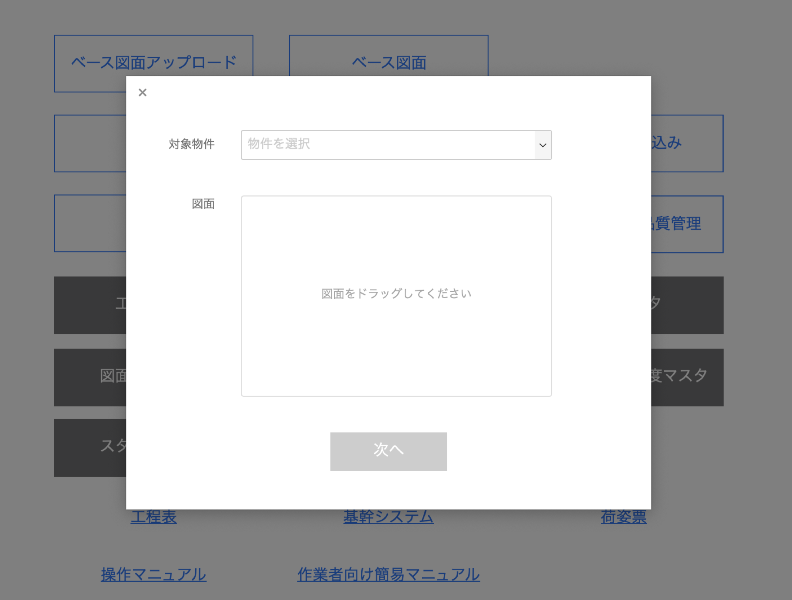
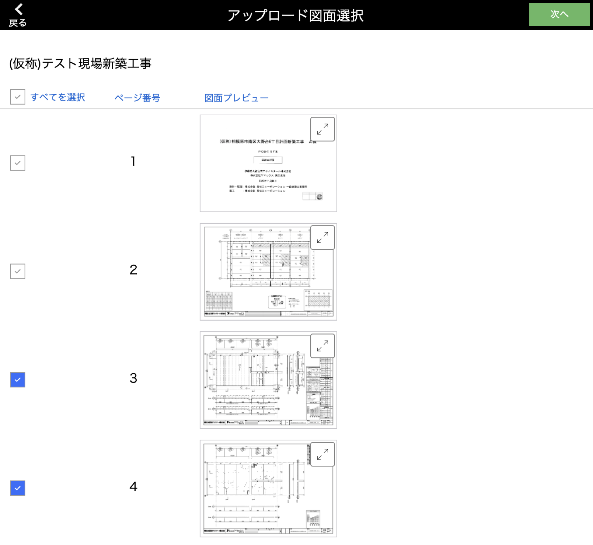
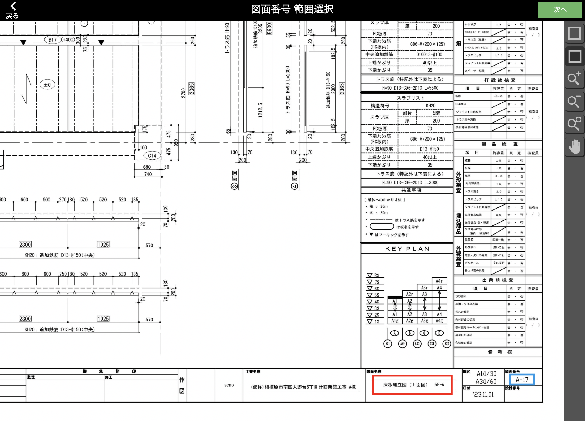
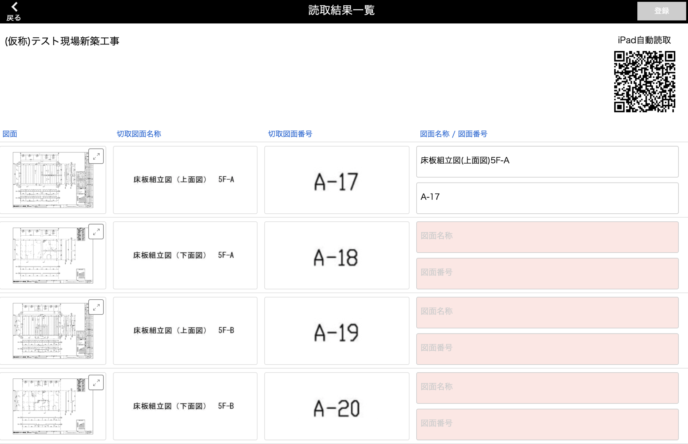
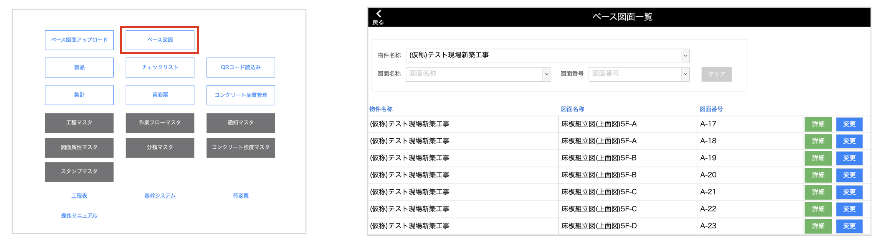

# ベース図面をアップロードする

 

{: .warning }
アップロードする図面の枚数が多いと処理に時間がかかります。

1. [品質管理システム]トップ画面から「ベース図面アップロード」を選択します。

    <table><tr><td>
    
    </td></tr></table>

2. 図面をアップロードする対象の物件を選択して、任意の図面をアップします。  
   「次へ」をクリックすることで図面を分割します。

    <table><tr><td>
    
    </td></tr></table>

3. 分割した図面の一覧が表示されます。  
   一覧の中からどの図面をアップロードするか選択して、「次へ」をクリックします。

    <table><tr><td>
    
    </td></tr></table>

4. [図面名称]、[図面番号]の読取範囲を指定します。  
    
    　　・図面名称：赤枠  
    　　・図面番号：黄枠  

    「次へ」をクリックで、指定した範囲の切り取り処理を行います。

    <table><tr><td>
    
    </td></tr></table>

5. 切り取った画像範囲が一覧で表示されます。  
   [図面名称]と[図面番号]を入力して、「登録」をクリックすることでベース図面のアップロードが完了します。

    <table><tr><td>
    
    </td></tr></table>

    {: .note }  
    切取画像の文字を自動で読み取りたい場合は、右上のQRコードをiPadで読み込むことで可能です。  
    ※入力済みの項目も全て読取内容で上書きされます。

    {: .warning }  
    未入力の[図面名称]、[図面番号]がある場合は登録に進むことができません。

6. アップロードしたベース図面は[品質管理システム]トップ画面の「ベース図面」に登録されます。

    <table><tr><td>
    
    </td></tr></table>
