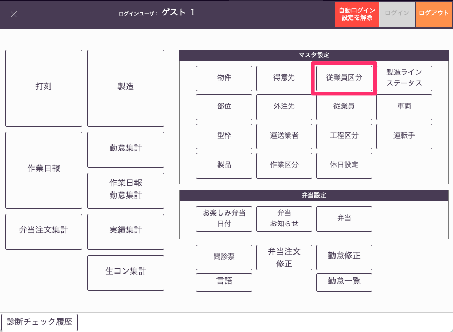
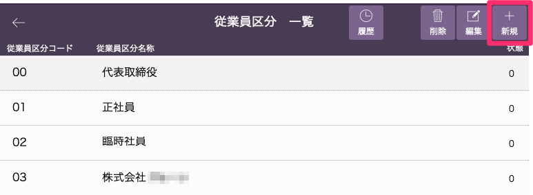
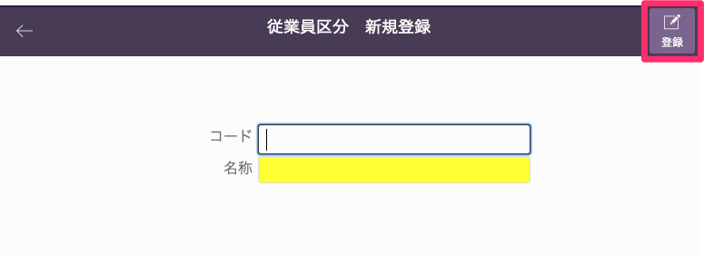

# 従業員区分登録

### 所属会社や雇用形態を登録します。

 
1. 「基幹システム」トップ画面の[マスタ設定]から「従業員区分」マスタを選択します。

    <table><tr><td>
    
    </td></tr></table>

1. [従業員区分一覧]画面から「新規」を選択します。

    <table><tr><td>
   
    </td></tr></table>

1. [コード]、[名称]を入力し、「登録」ボタンを選択します。

    <table><tr><td>
    
    </td></tr></table>

1. 従業員一覧に従業員が登録されます。