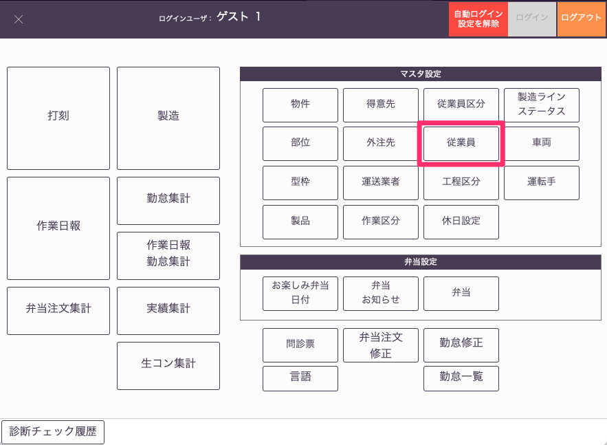
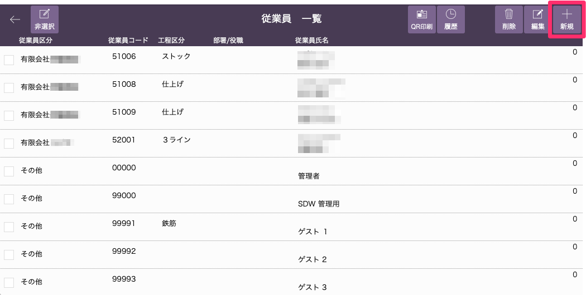
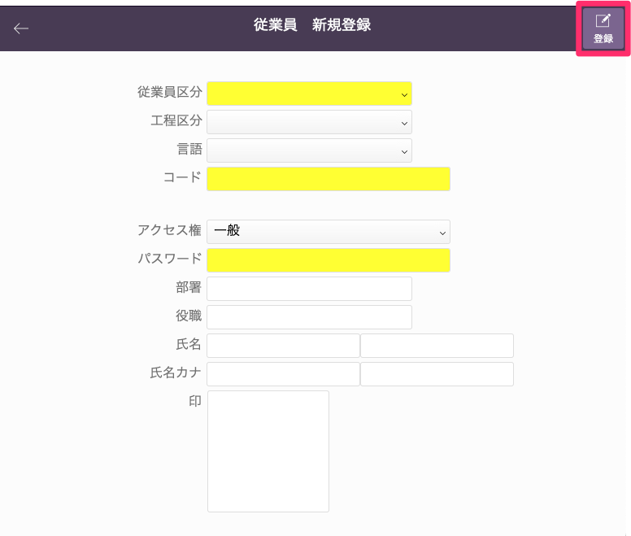
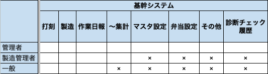
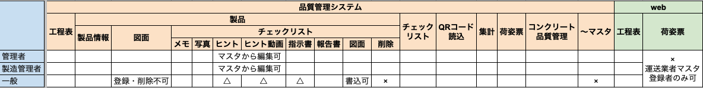

# 従業員登録
### 所属会社や雇用形態を登録します。

{: .warning }
事前に「従業員区分」の設定が必要です。

1. 「基幹システム」トップ画面の[マスタ設定]から「従業員」マスタを選択します。

    <table><tr><td>
    
    </td></tr></table>

1. [従業員一覧]画面から「新規」を選択します。

    <table><tr><td>
    
    </td></tr></table>

1. 必要項目を入力し、「登録」ボタンを選択します。入力欄が黄色になっている項目は登録時に入力必須の項目になります。

    <table><tr><td>
    
    </td></tr></table>

    * アクセス権
        * 管理者：ほぼ全ての項目を編集できます。
        * 製造管理者：主に基幹システムのマスタデータ以外の項目を編集できます。
        * 一般：主に業務に必要な項目のみ閲覧または編集できます。

     
    アクセス権の差異についての詳細は以下画像をご参照ください。  
    空欄：編集可　△：編集不可　×：閲覧不可
    <table><tr><td>
      
    </td></tr></table>

    <table><tr><td>
      
    </td></tr></table>

1. 従業員一覧に従業員が登録されます。