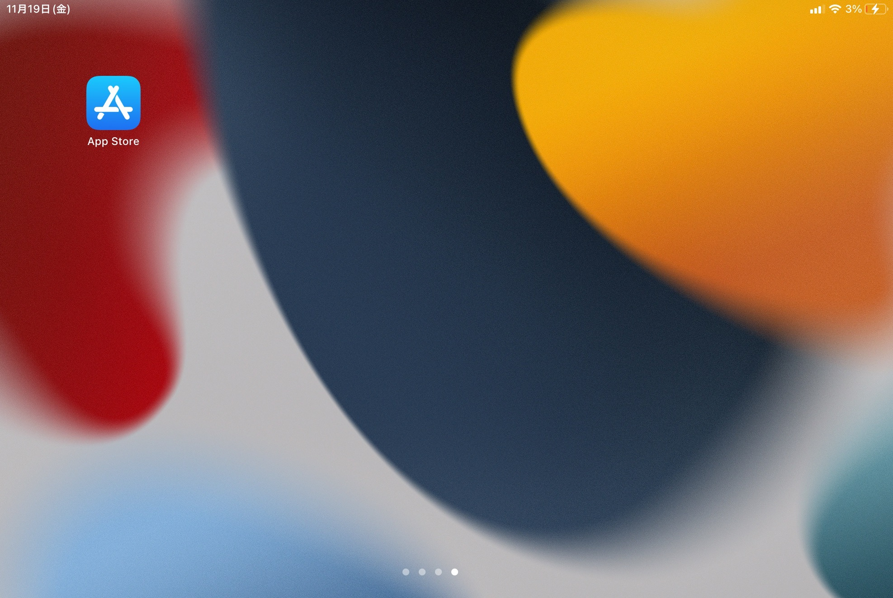
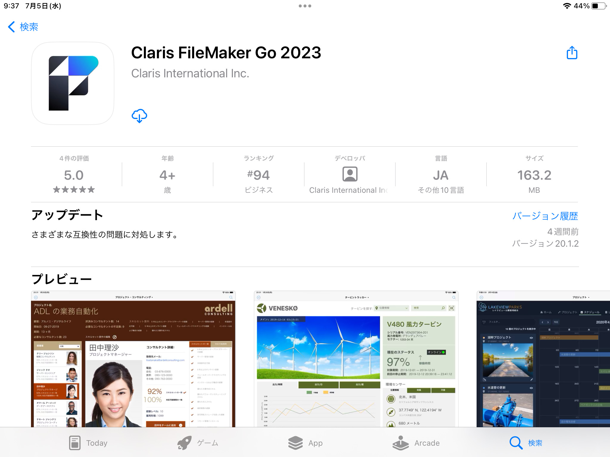
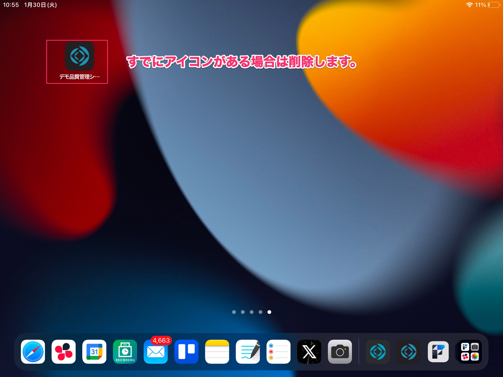
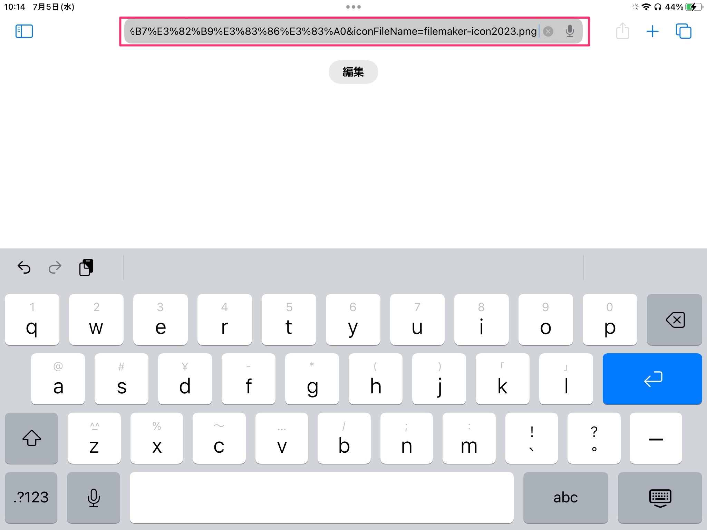
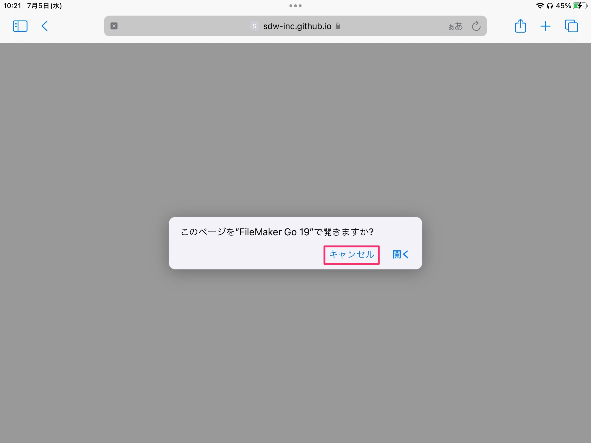
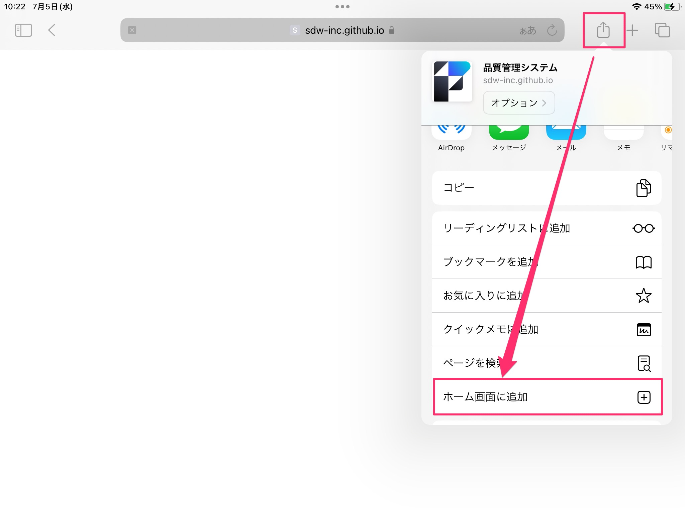
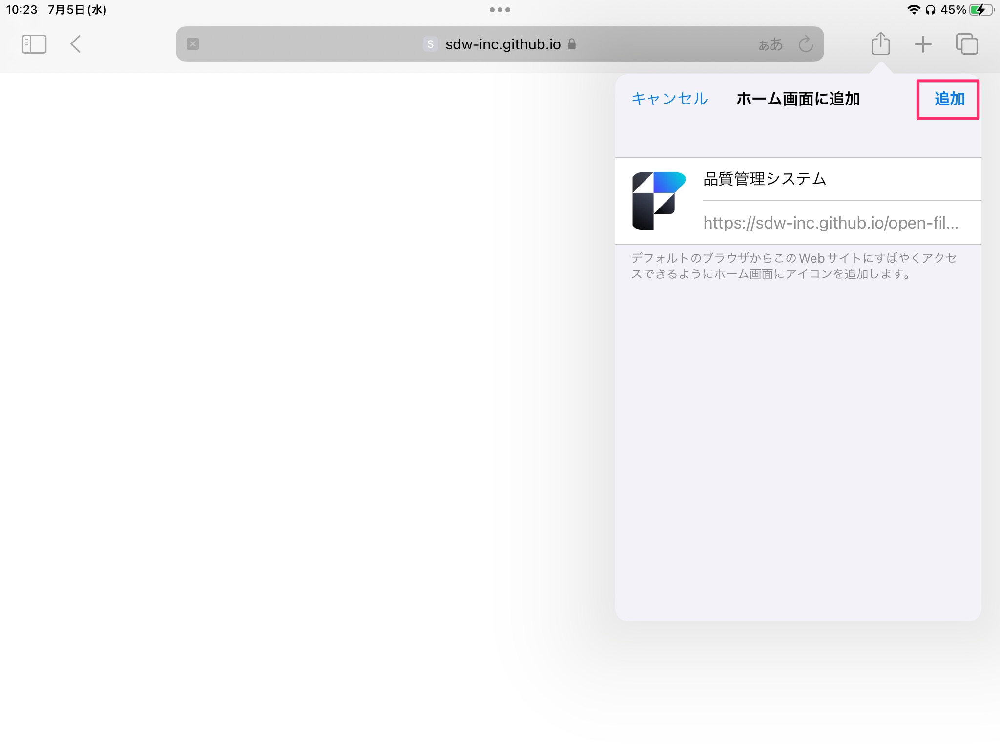
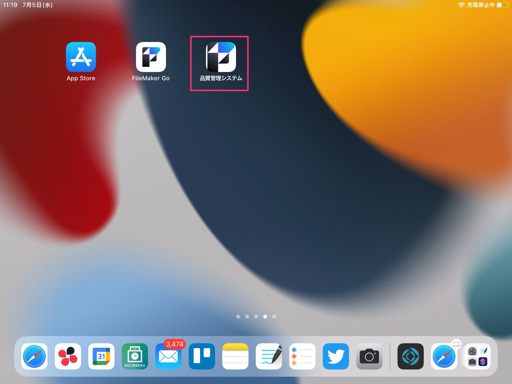

# iPadセットアップ手順
{: .no_toc }

## 目次
{: .no_toc .text-delta }

1. TOC
{:toc}

---

## FileMaker Goのインストール（インストール済みの方は不要）

 
1. AppStoreアプリを起動します。

    <table><tr><td>
    
    </td></tr></table>

1. 検索機能を使い、「FileMaker」で検索します。

    <table><tr><td>
    
    </td></tr></table>

1. 検索結果から「FileMaker Go 2023」のページを開き、ダウンロードします。

    <table><tr><td>
    
    </td></tr></table>

1. ダウンロードが完了したら、FileMaker Goを起動します。

    <table><tr><td>
    
    </td></tr></table>

1. 起動できればインストール終了です。

## FileMakerServerへ接続するショートカットを作成する

1. ホーム画面にすでにショートカットのアイコンがある場合は、ショートカットを削除してください。  
    アイコンの削除方法の参考リンク：[https://www.softbank.jp/support/faq/view/11900](https://www.softbank.jp/support/faq/view/11900)
    
    <table><tr><td>
    
    </td></tr></table>

1. 「Safari」アプリを開いて、別途お送りしているリンクを開きます。

    <table><tr><td>
     
     </td></tr></table>

1. ダイアログが表示されたら、[キャンセル]をタップします。

    <table><tr><td>
     
     </td></tr></table>

1. 真っ白なページが表示されます。  
    右上の共有ボタンをタップして、[ホーム画面に追加]をタップします。

    <table><tr><td>
     
     </td></tr></table>

1. [追加]をタップして保存します。

    <table><tr><td>
     
     </td></tr></table>

1. ホーム画面に アイコンが追加されればOKです。

    <table><tr><td>
     
     </td></tr></table>

1. 1~5の手順を[品質管理システム]、[基幹システム]の二つで行ないます。

1. ホーム画面に追加されたアイコンをそれぞれタップし、システムが起動できればこの手順は終了です。

