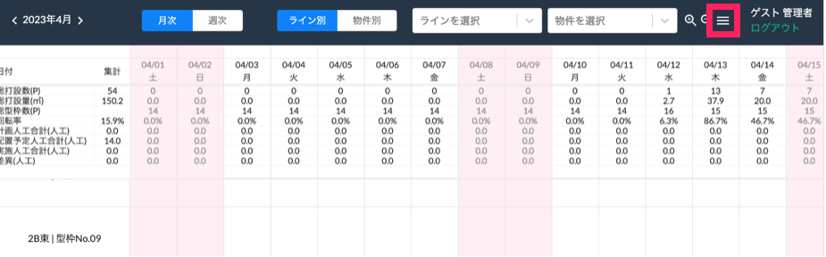
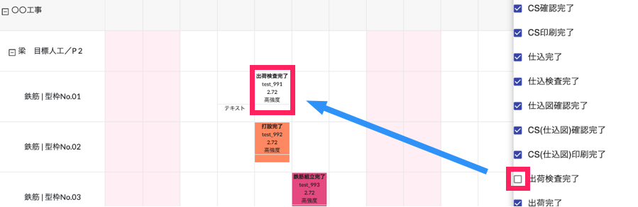
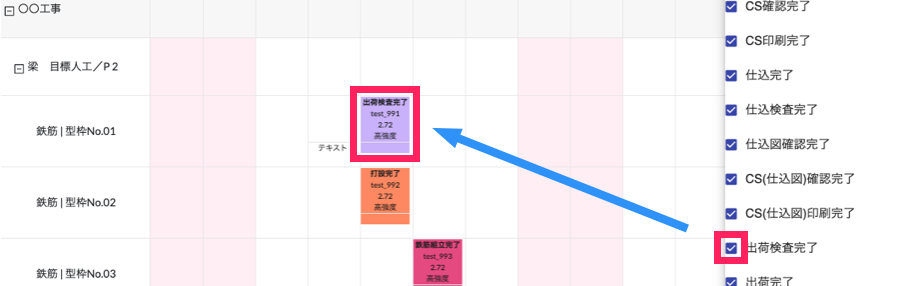

# 色付け対象の選択

 
1. [WEB工程表]画面上右上の「≡」アイコンから色付け対象の選択ができます。

    <table><tr><td>
    
    </td></tr></table>

1. ステータスの文字背景に色をつけたくない場合は、色付けしたくないステータスの☑︎を外すことで背景色をなしにすることができます。

    <table><tr><td>
    
    </td></tr></table>

1. 再度色付けをしたい場合は、☑︎をつけることで背景に色付けが可能です。

    <table><tr><td>
    
    </td></tr></table>

※背景色の変更方法は「[ステータス設定]()」を参照してください。
