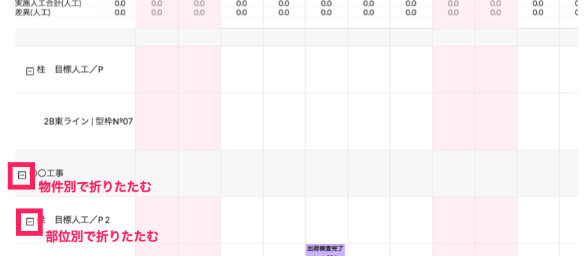
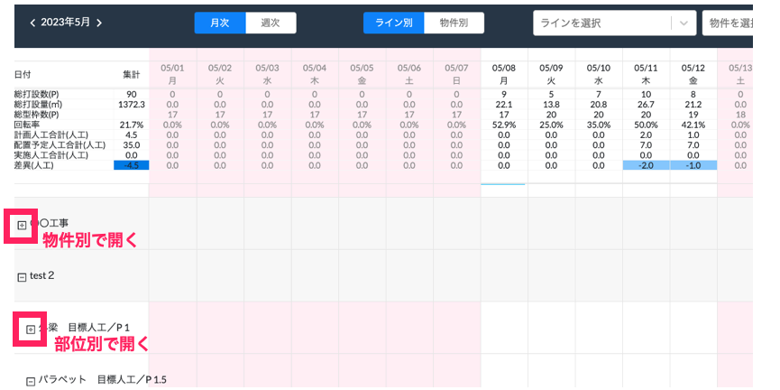

# 折りたたみ機能

 
1. 表示させたくない物件、部位名の左側にある「−」マークをクリックすることで、それぞれの行を閉じることができます。

    <table><tr><td>
    
    </td></tr></table>

1. 再度表示させたい場合は、表示させたい物件、部位名の左側にある「＋」マークをクリックすることで、表示させることができます。

    <table><tr><td>
    
    </td></tr></table>
