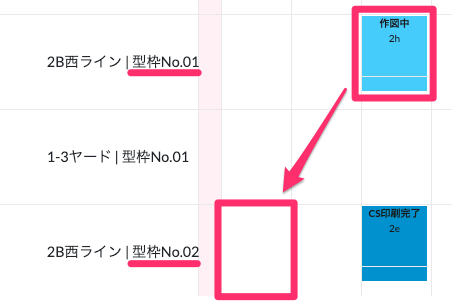
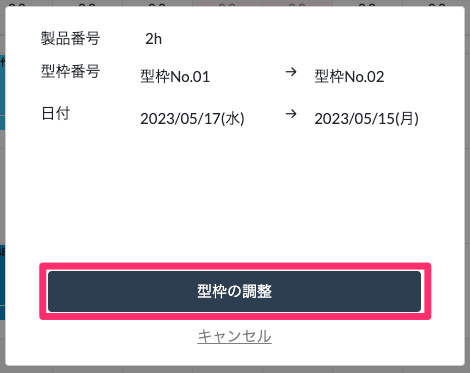
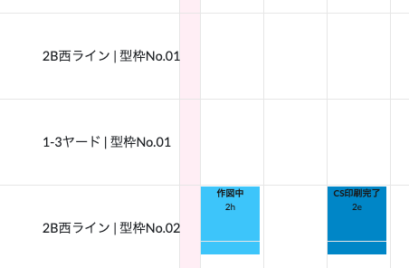

# 型枠の調整

 
1. 型枠を調整したい製品を、変更後の型枠の行の日付にドラッグ&ドロップします。

    <table><tr><td>
    
    </td></tr></table>

1. 「型枠の調整」を選択し、確認表示が出たら「OK」を選択します。

    <table><tr><td>
    
    </td></tr></table>

1. 製品の型枠、あるいはそれに加えて打設完了予定日が変更されます。

    <table><tr><td>
    
    </td></tr></table>