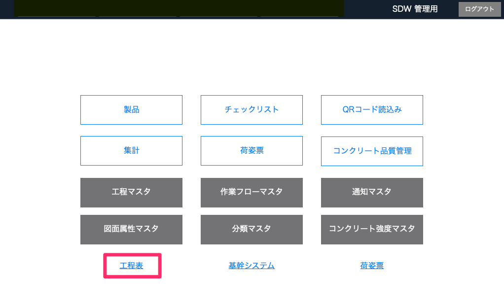
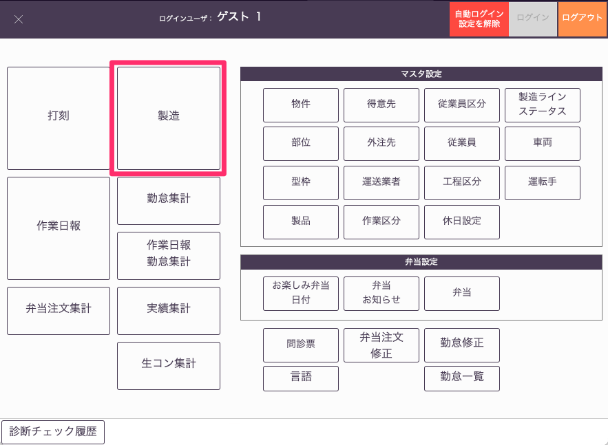
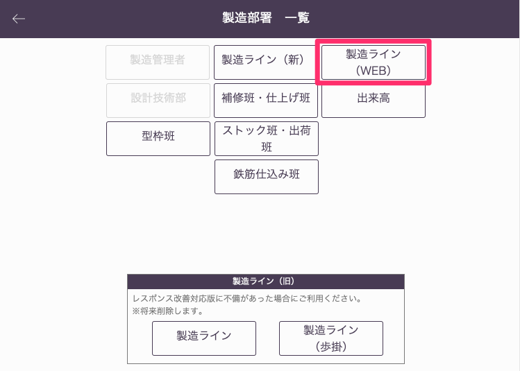
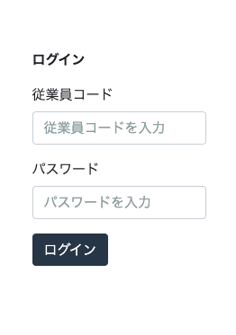

# WEB工程表へのアクセス

### WEB工程表へのアクセス方法は下記の３パターンがあります。

### パターン1「品質管理システムからアクセス」

品質管理システム：工程表（最下段左）

<table><tr><td>

</td></tr></table>

### パターン2「基幹システムからアクセス」

基幹システム：製造>製造ライン（WEB）

<table><tr><td>

</td></tr></table>
<table><tr><td>

</td></tr></table>

### パターン3「URLからアクセス」

会社から指定されたURLで検索し、[コード]と[パスワード]を入力してWEB工程表にログインします。  
（項目設定：[基幹システム_従業員マスタ]()）

<table><tr><td>

</td></tr></table>