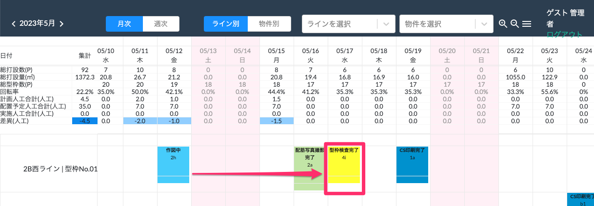
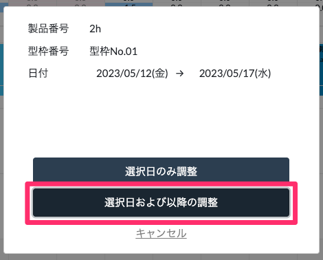
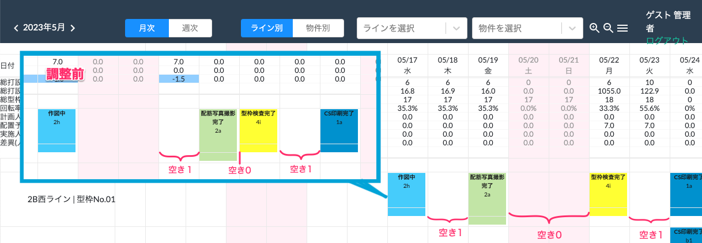

# 選択日と以降の日付を移動

 
1. 打設完了予定日を変更したい製品を、同じ行内の変更後の日付にドラッグ＆ドロップします。

    <table><tr><td>
    
    </td></tr></table>

1. 「選択日および以降の調整」を選択し、確認表示が出たら「OK」を選択します。

    <table><tr><td>
    
    </td></tr></table>

1. 製品の打設完了予定日が変更されます。他の製品の打設完了予定日と重なる・跨ぐ移動の場合、他の製品が製品間の製造ラインの空き日数を保持したまま移動します。  
また、休日は空き日数の計算には含まれません。(手動で移動した製品は休日に割り振ることも可能です。)

    <table><tr><td>
    
    </td></tr></table>