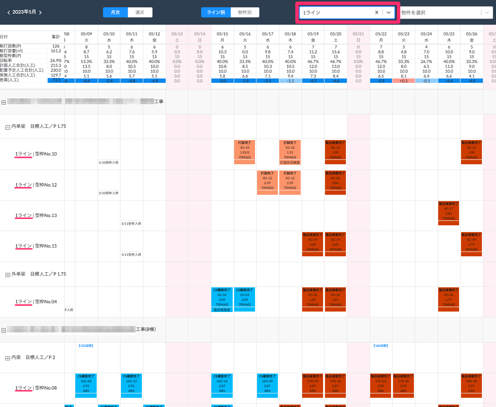
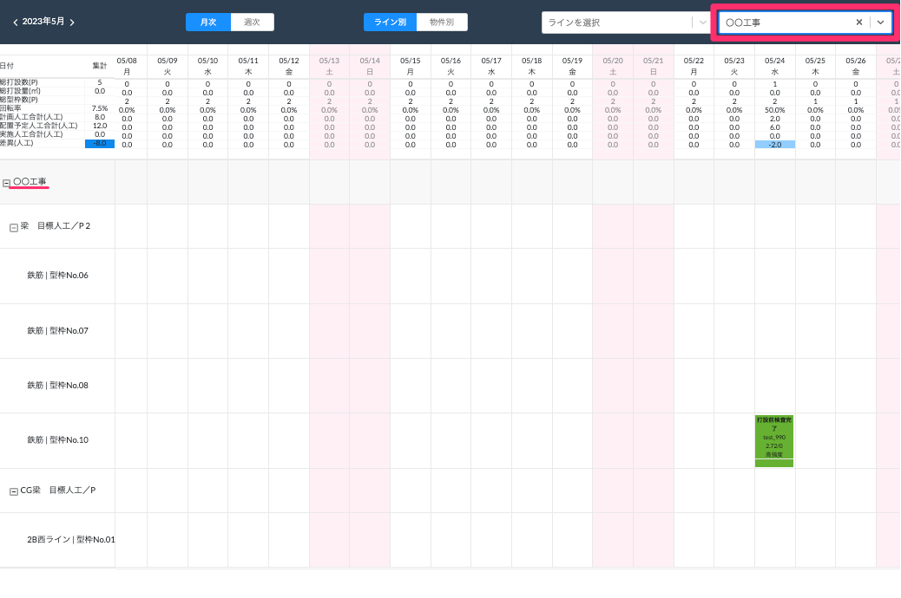
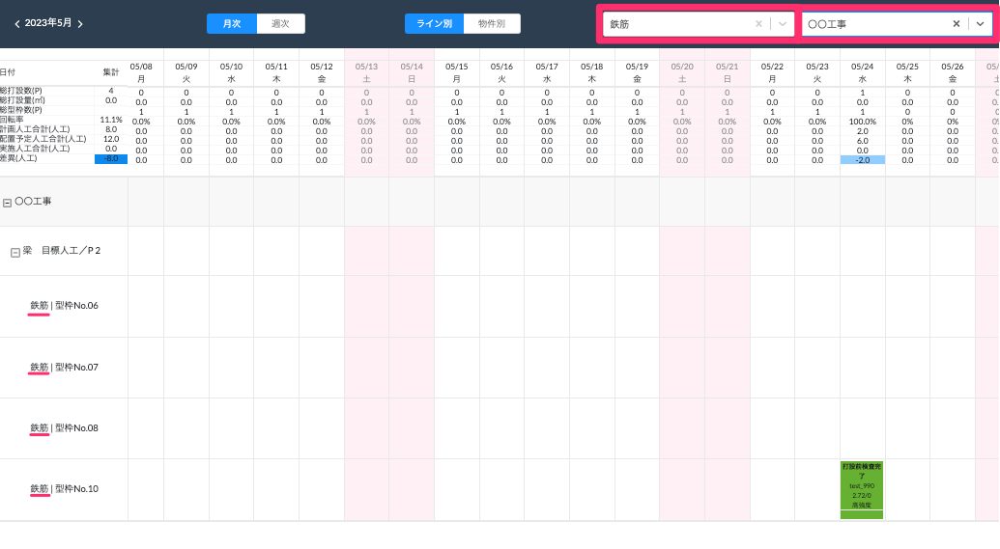

# 表示する項目の絞り込み

 
1. 画面上部のプルダウンメニューから物件・製造ラインを選択します。

1. 絞り込み結果が表示されます。

### 製造ラインで絞り込み

<table><tr><td>

</td></tr></table>

### 物件で絞り込み

<table><tr><td>

</td></tr></table>

### 製造ラインと物件で絞り込み

<table><tr><td>

</td></tr></table>
