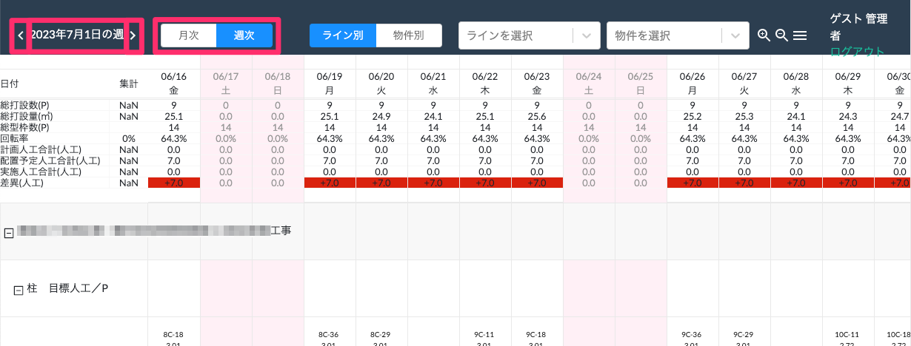

# 表示する期間の変更

 
1. 画面上部の「月次」・「週次」ボタンを選択します。

    <table><tr><td>
    
    </td></tr></table>

1. 画面左上の< >ボタンか、「○○年○○月」・「〇〇年○月〇日の週」の表記部分を選択します。

1. 表示したい年月日を選択します。

1. 表示期間が反映されます。

    月次：「○月」の1日〜末日表示  
    週次：「○日」の前後約二週間