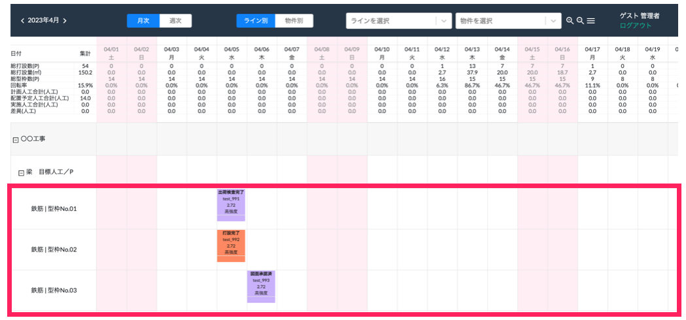
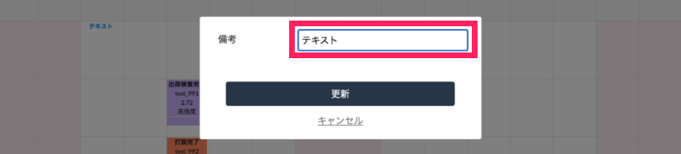
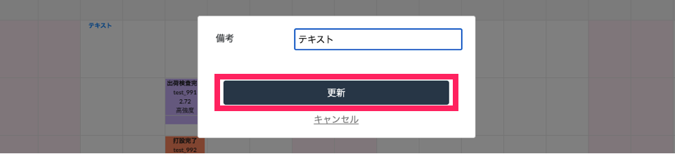
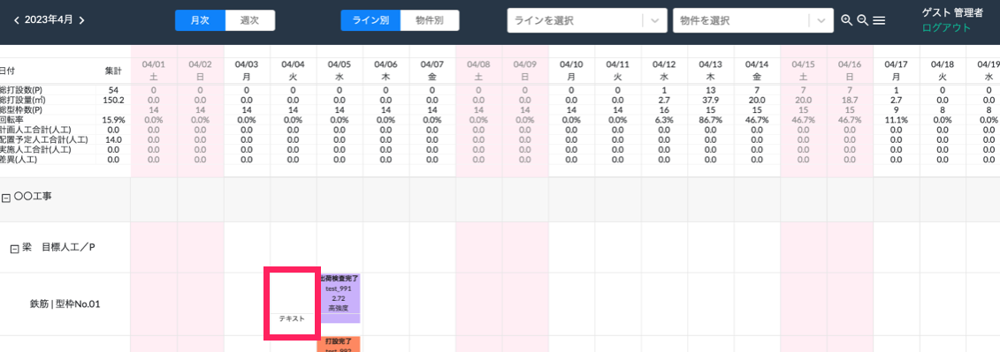

# 備考の記入

 
1. コメントを書きたい日付の型枠番号行をクリックします。

    <table><tr><td>
    
    </td></tr></table>

1. 「備考」の項目に任意のコメントを入力します。

    <table><tr><td>
    
    </td></tr></table>

1. 「更新」をクリックします。

    <table><tr><td>
    
    </td></tr></table>

1. WEB工程表に入力したコメントが表示されます。

    <table><tr><td>
    
    </td></tr></table>