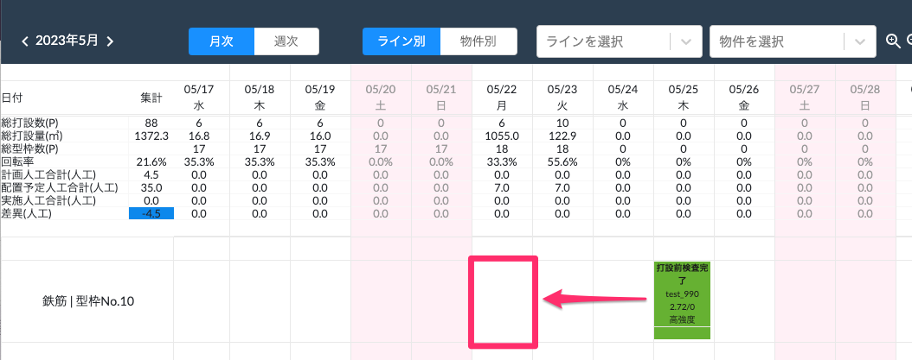
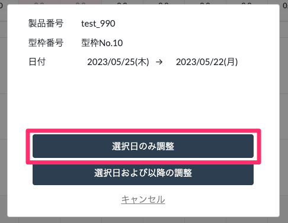
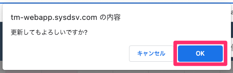
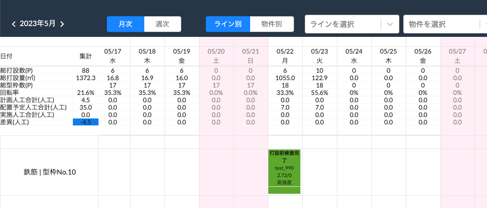

# 選択日のみ日付を移動

 
1. 打設完了予定日を変更したい製品を、同じ行内の変更後の日付にドラッグ&ドロップします。

    <table><tr><td>
    
    </td></tr></table>

1. 「選択日のみ調整」を選択し、確認表示が出たら「OK」を選択します。

    <table><tr><td>
    
    </td></tr></table>
     

    <table><tr><td>
    
    </td></tr></table>

1. 製品の打設完了予定日が変更されます。(手動で移動した製品は休日に割り振ることも可能です。)

    <table><tr><td>
    
    </td></tr></table>