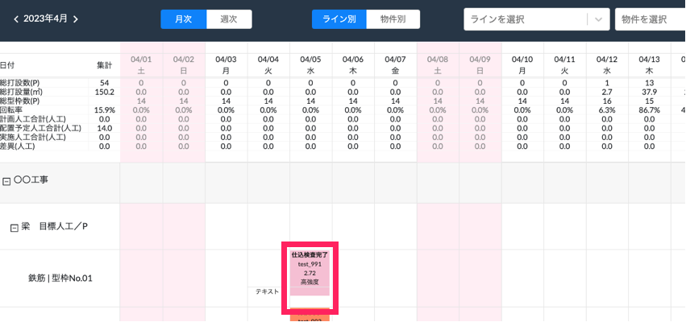
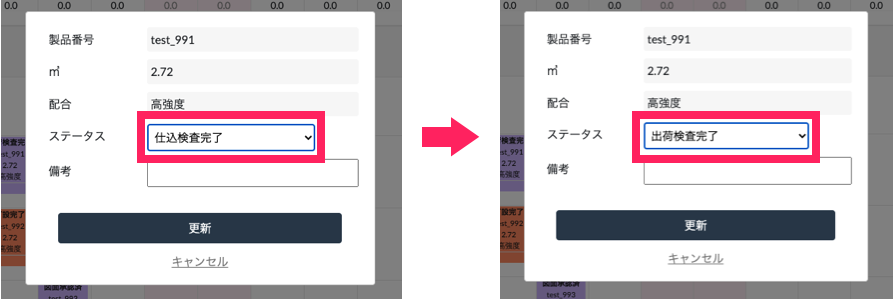
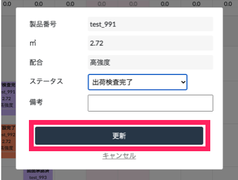
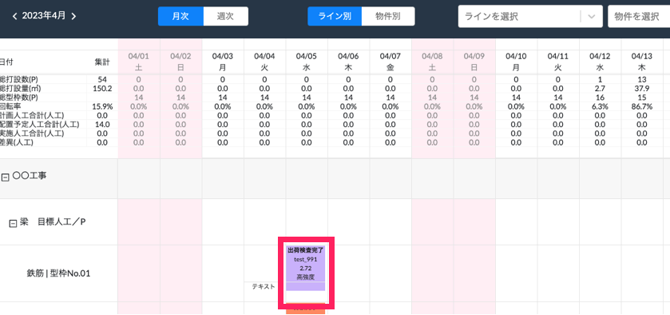

# ステータスの変更

{: .warning }
基本的には製品の品質チェックを行う工程で（ステータス設定がされている場合）自動で変更されます。

1. 変更したいステータスをクリックします。

    <table><tr><td>
    
    </td></tr></table>

1. [ステータス]の項目で変更したいステータスを選択します。

    <table><tr><td>
    
    </td></tr></table>

1. 「更新」をクリックします。

    <table><tr><td>
    
    </td></tr></table>

1. WEB工程表に変更後のステータスが表示されます。

    <table><tr><td>
    
    </td></tr></table>