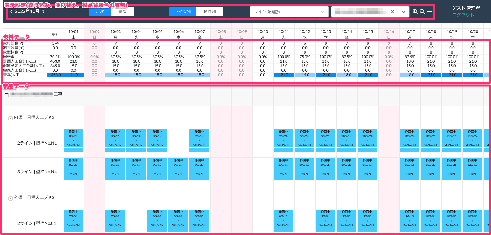

# 工程管理

### 画面概要

<table><tr><td>

</td></tr></table>

### 項目詳細

|                            | 詳細                                                                                                                                                                                                                                                                 | 過去の日付     | 参照元                                                   | 備考                                                                               | 
| -------------------------- | -------------------------------------------------------------------------------------------------------------------------------------------------------------------------------------------------------------------------------------------------------------------- | -------------- | -------------------------------------------------------- | ---------------------------------------------------------------------------------- | 
| 総打設数(P)                | その日[表示期間]打設予定の製品の合計数                                                                                                                                                                                                                               | 再計算しない   | 基幹システム：製品 > 打設完了予定日                      |                                                                                    | 
| 総打設量(㎥)               | その日[表示期間]打設予定の生産量の合計                                                                                                                                                                                                                               | 再計算しない   | 基幹システム：製品 > ㎥                                  |                                                                                    | 
| 総型枠数(P)                | 当月に打設する物件の部位毎の型枠の総数(打設完了したものは減算していく)                                                                                                                                                                                               | 再計算しない   | 基幹システム：物件、部位、型枠                           |                                                                                    | 
| 回転率                     | 総打設数 / 総型枠数（小数点第1位まで）                                                                                                                                                                                                                               | 再計算しない   |                                                          |                                                                                    | 
| 計画人口合計 (人工)     | 物件の部位に設定されている目標人工 / Pの合計                                                                                                                                                                                                                         | 再計算しない   | 基幹システム：物件 > 物件に対する部位設定 > 目標人工 / P |                                                                                    | 
| 配置予定人工 合計(人工) | 製造ライン毎の従業員(作業量)の総数                                                                                                                                                                                                                                   | 再計算しない   | 基幹システム：従業員 > 工程区分                          |                                                                                    | 
| 実施人工合計 (人工)     | 組置人工数 + 打設人工数                                                                                                                                                                                                                                              | 常に再計算する | 基幹システム：作業日報 > 製造ライン > 打設、組置         |                                                                                    | 
| 差異(人工)                 | ■未来(当日も含む) ・実施人工がある場合 　実施人工 ー 計画人工 ・実施人工がない場合 　配置予定人工 ー 計画人工 ■過去 ・実施人工がある場合 　実施人工 ー 計画人工 ・実施人工がない場合 　実施人工 ー 計画人工(実施人工が0のため、差異も0) | 常に再計算する |                                                          | 計画人工合計から20%離れたら強調表示 -n < -20 < 0 < 20 < n 青<薄青<白<薄赤<赤 | 