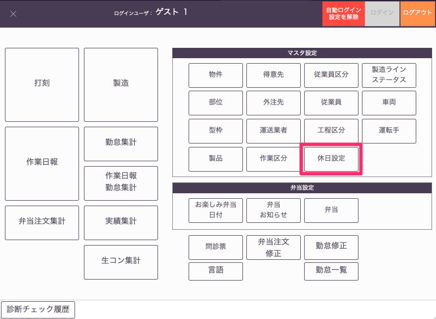
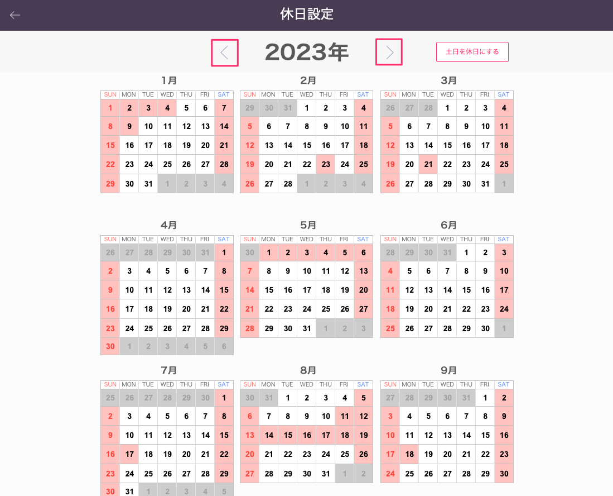

# 休日設定マスタ

 
1. 「基幹システム」トップ画面の[マスタ設定]から「休日設定」を選択します。

    <table><tr><td>
    
    </td></tr></table>

2. 年表記の左右のボタンを選択して、休日設定したい年度を表示します。

    <table><tr><td>
    
    </td></tr></table>

3. 日付をクリックすることで、稼働日（白）と休日（赤）の設定をすることができます。

4. 休日マスタの設定がweb工程表、コンクリート品質管理に反映されます。