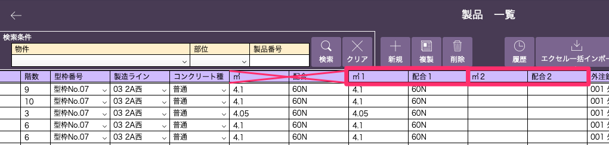
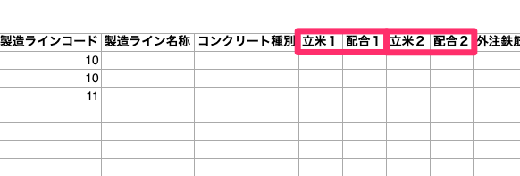

# 製品登録(情報追加)

### WEB工程表を作る上で必要な情報を製品マスタに追加します。

 
1. [製品マスタの登録]()を参考に製品情報を編集します。  
　製品情報の編集画面に移動します。  
　基幹システム：製品 > 製品一覧(情報追加したい製品を選択) > 編集  
　または[項目内容を更新する]エクセルファイルを開きます。  

2. 以下の項目を追記します。

    - 立米1(または㎥１：打設量)

    - 配合1(複数の配合を含む製品の場合、立米2(㎥2)と配合2も記入)

<table><tr><td>

</td></tr></table>

<table><tr><td>

</td></tr></table>

{: .warning }
[㎥]、[配合]項目は㎥1、2と配合1、2を元に自動計算される項目のため入力しないでください。