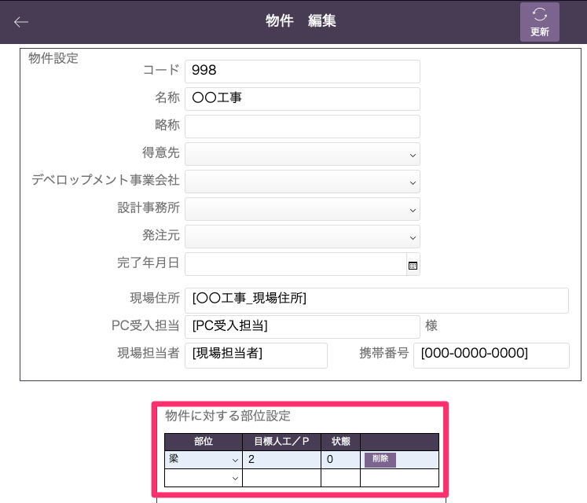
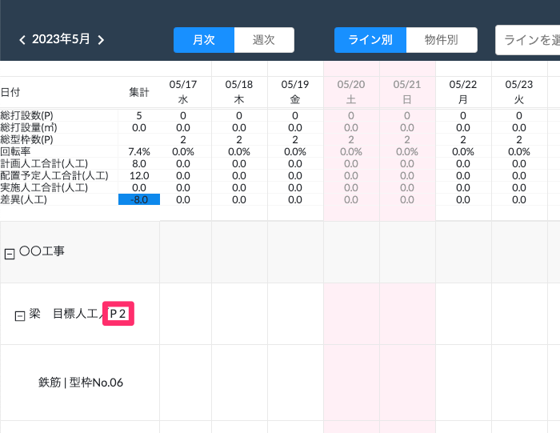

# 物件登録（情報追加）

### WEB工程表を作る上で必要な情報を物件マスタに追加します。

 
1. 物件情報の編集画面に移動します。  
    基幹システム：物件 > 物件一覧(情報追加したい物件を選択) > 編集

1. [物件に対する部位設定]項目で、[部位]を選択し、[目標人工/P]を設定します。

    <table><tr><td>
    
    </td></tr></table>

1. WEB工程表の部位項目に設定した目標人工が反映されます。

    <table><tr><td>
    
    </td></tr></table>