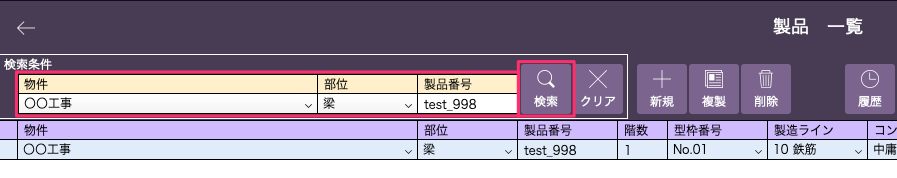
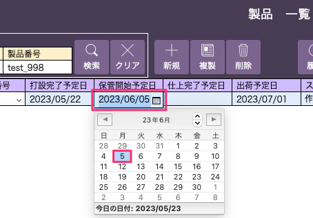

# 製品情報を変更する

 
1. 「基幹システム」トップ画面の「製品」マスタを選択し、[製品一覧]画面を開きます。  
変更したい製品を物件、部位で絞り込み、あるいは製品番号を入力して「検索」します。

    <table><tr><td>
    
    </td></tr></table>

1. 変更したい項目欄を選択して入力します。

    <table><tr><td>
    
    </td></tr></table>
