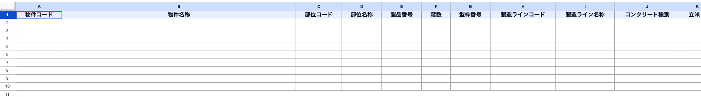
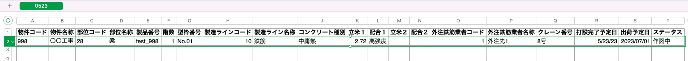
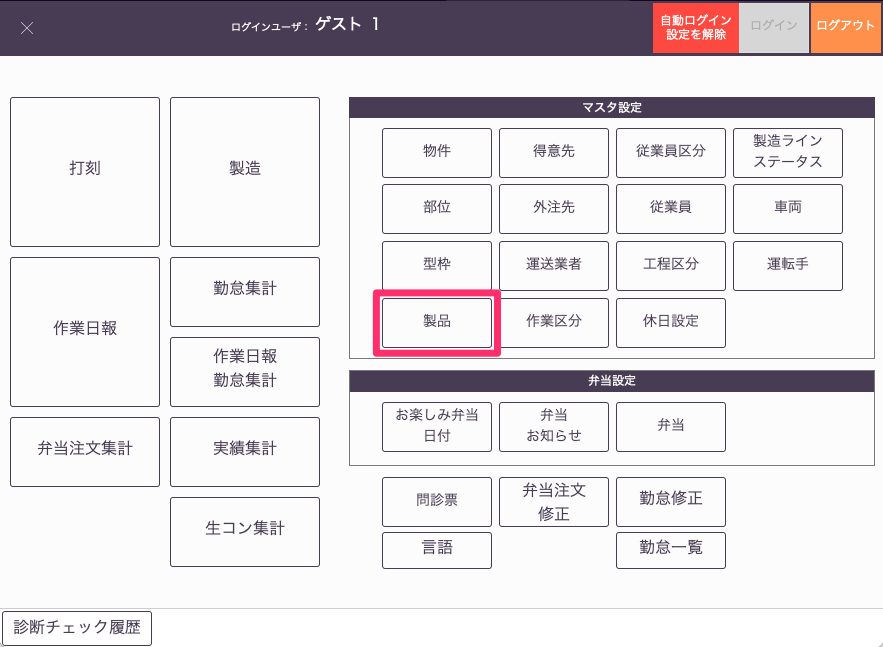
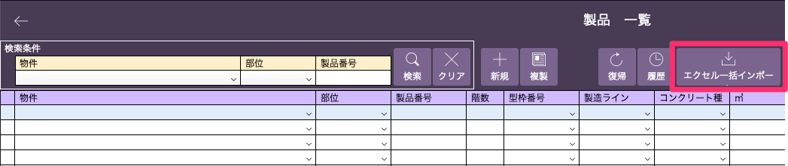
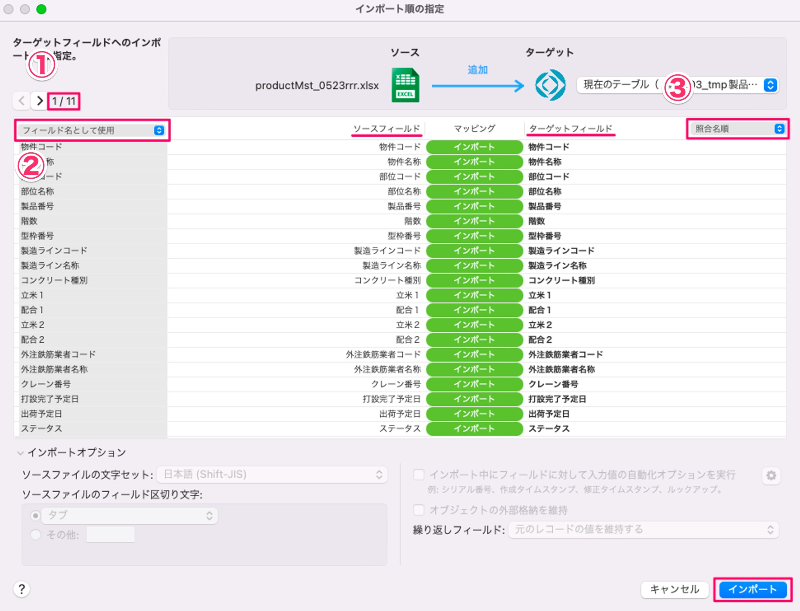
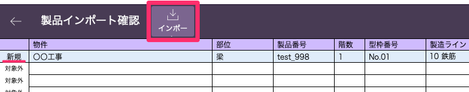

# 製品マスタをexcelからインポートする

 
1. 製品データを入力するエクセルファイルをダウンロードします。

    <table><tr><td>
    
    </td></tr></table>

2. エクセルファイルのフォーマットに沿ってマスタで事前設定した値、あるいは任意の値を入力します。

    <table><tr><td>
    
    </td></tr></table>

3. エクセルファイルを読み込みます。「基幹システム」トップ画面の[マスタ設定]から「製品」マスタを選択して、[製品一覧]画面から「エクセル一括インポート」を選択します。

    <table><tr><td>
    
    </td></tr></table>
    <table><tr><td>
    
    </td></tr></table>

4. インポートするファイルを選択して、「開く」を選択します。

5. 「インポート順の設定」ウインドウで設定を確認して「インポート」を選択します。  
    二回目以降は設定が記憶されるため、設定を変更せずインポートしてください。

    {: .warning }  
    エクセルファイルの一行目の名称は変更しないでください。

    【初回】  
    ① 1/xxx  
    ② 「フィールド名として使用」  
    ③ 「照合名順」  

    【二回目以降の表示】  
    ① 2/xxx  
    ② 「データ」  
    ③ 「照合名順」  

    <table><tr><td>
    
    </td></tr></table>

6. 次のウインドウで「OK」を選択して、登録したい製品データの最左列に[新規]と表示されていることを確認します。  
    内容に問題がなければ「インポート」を選択して、製品マスタへのインポートを完了します。

    <table><tr><td>
    
    </td></tr></table>

7. [製品一覧]画面に製品情報が登録されます。

    <table><tr><td>
    
    </td></tr></table>