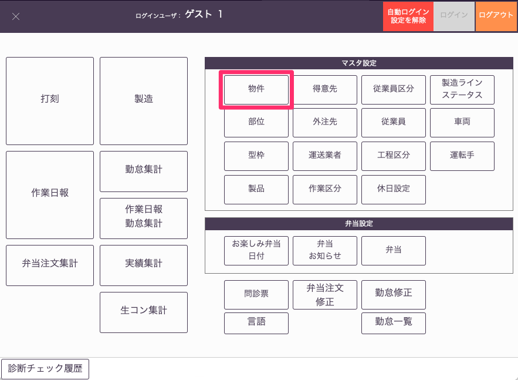
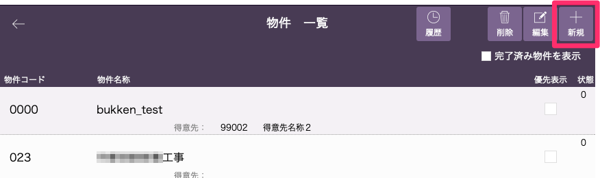
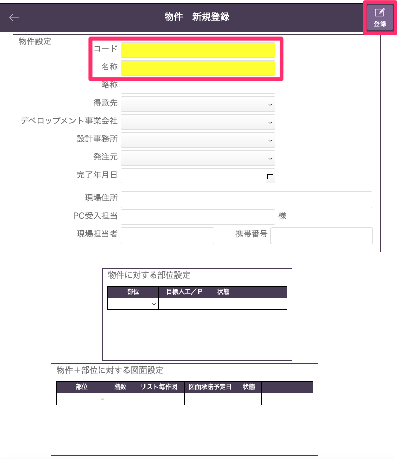
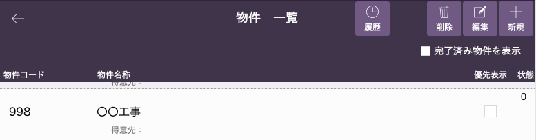

# 物件マスタ設定

 
1. 「基幹システム」トップ画面の[マスタ設定]から「物件」マスタを選択します。

    <table><tr><td>
    
    </td></tr></table>

1. [物件一覧]画面から「新規」を選択します。

    <table><tr><td>
    
    </td></tr></table>

1. [物件名称]、[物件コード]を入力して、「登録」ボタンを選択します。

    入力欄が黄色になっている項目は登録時に入力必須の項目になります。

    <table><tr><td>
    
    </td></tr></table>

1. 物件一覧に物件が登録されます。

    製品登録時に選択したり、検索時に物件名称、物件コードを使用することができるようになります。

    <table><tr><td>
    
    </td></tr></table>
