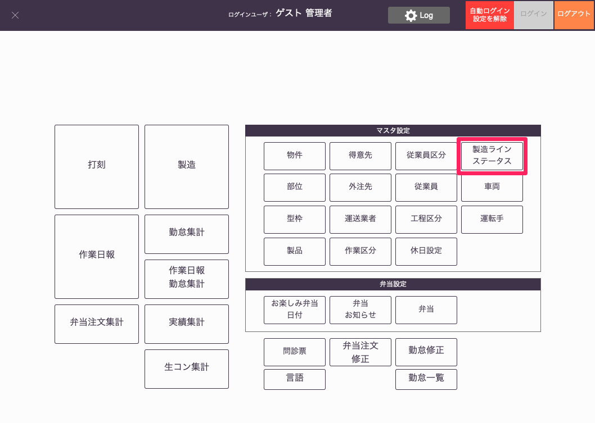
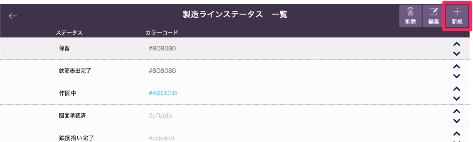
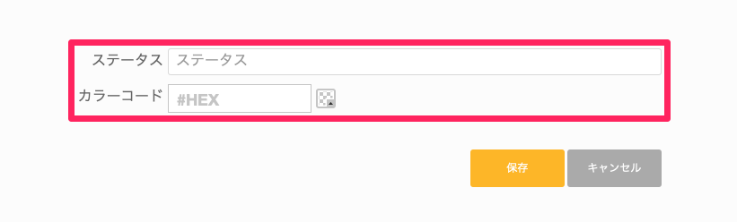
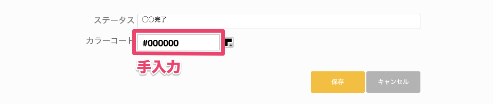
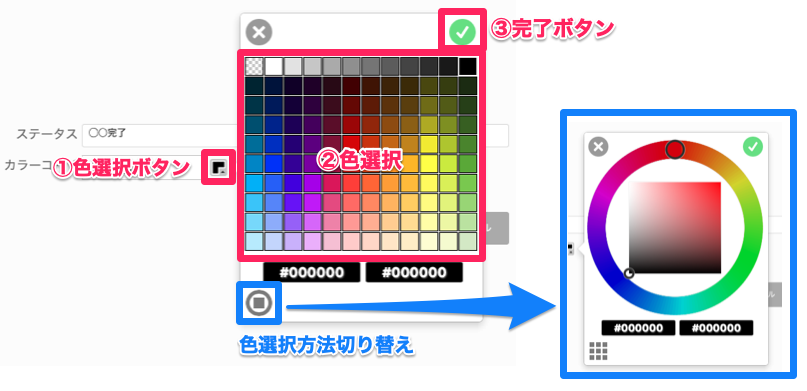
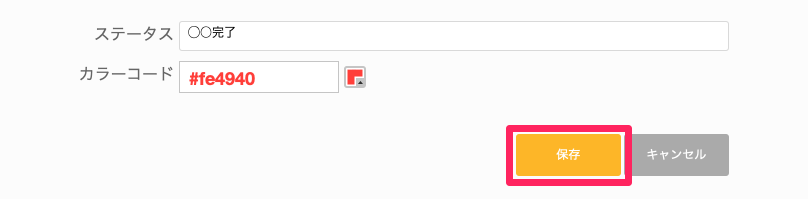
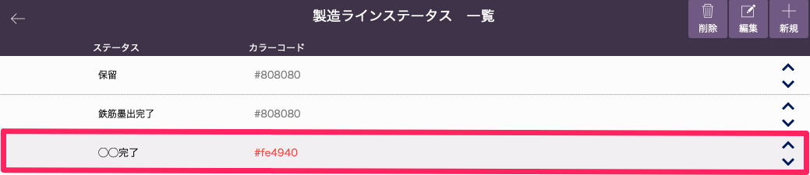

# 製造ラインステータス設定

 
1. 「基幹システム」トップ画面の[マスタ設定]から「製造ラインステータス」を選択します。

    <table><tr><td>
    
    </td></tr></table>

2. [製造ラインステータス一覧]画面から右上の「新規」を選択します。

    <table><tr><td>
    
    </td></tr></table>

3. [ステータス名]と[カラーコード]を入力します。

    <table><tr><td>
    
    </td></tr></table>

    ※[カラーコード]は手入力するか、入力欄の右にあるボタンから任意の色を設定します。

    <table><tr><td>
    
    </td></tr></table>

    <table><tr><td>
    
    </td></tr></table>

4. 「保存」ボタンを選択します。

    <table><tr><td>
    
    </td></tr></table>

5. 「製造ラインステータス一覧」画面にステータスが登録されます。

    <table><tr><td>
    
    </td></tr></table>

同様に他の項目をマスタ設定します。

