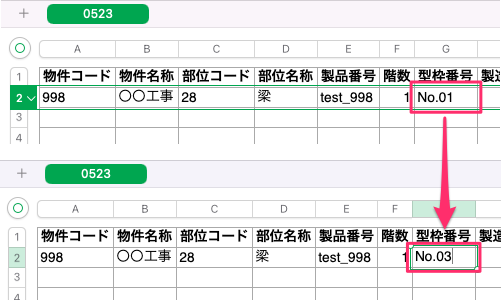
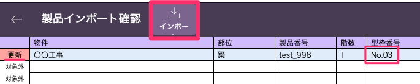

# 項目内容の更新(エクセルデータの再インポート)

{: .warning }
物件コード、部位コード、製品番号が全て同じ場合に同一製品と判定しているため、上記の３項目を編集した行は新規データとして登録されます。

1. 既に登録した製品のエクセルデータを開き、更新したい項目を編集し保存します。

    <table><tr><td>
    
    </td></tr></table>

1. 「基幹システム」トップ画面の[マスタ設定]から「製品」マスタを選択して、[製品一覧]画面から「エクセル一括インポート」を選択します。

1. インポートするファイルを選択して、「開く」を選択します。

1. [インポート順の指定]()を参考に設定を行い、「インポート」を選択します。

1. 「OK」を選択し、登録したい製品データの最左列に[更新]と表示されていることを確認します。  
    確認ができたら「インポート」を選択して完了です。

    <table><tr><td>
    
    </td></tr></table>