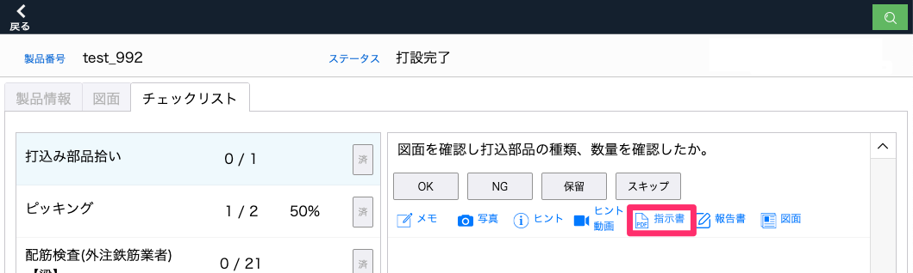
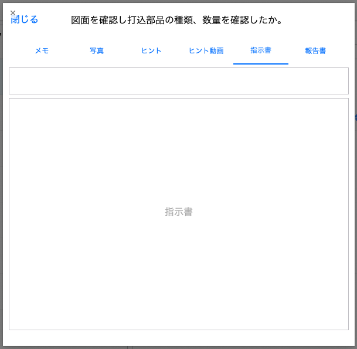

# 工程の指示書を登録する

1. 品質管理システム：製品 > [製品一覧]から製品を選択し、「チェックリスト」タブから工程を選択し、チェック項目の「指示書」を選択します。

    <table><tr><td>
    
    </td></tr></table>

1. ヒントテキストを記入、指示書をpdf形式で挿入します。

    <table><tr><td>
    
    </td></tr></table>