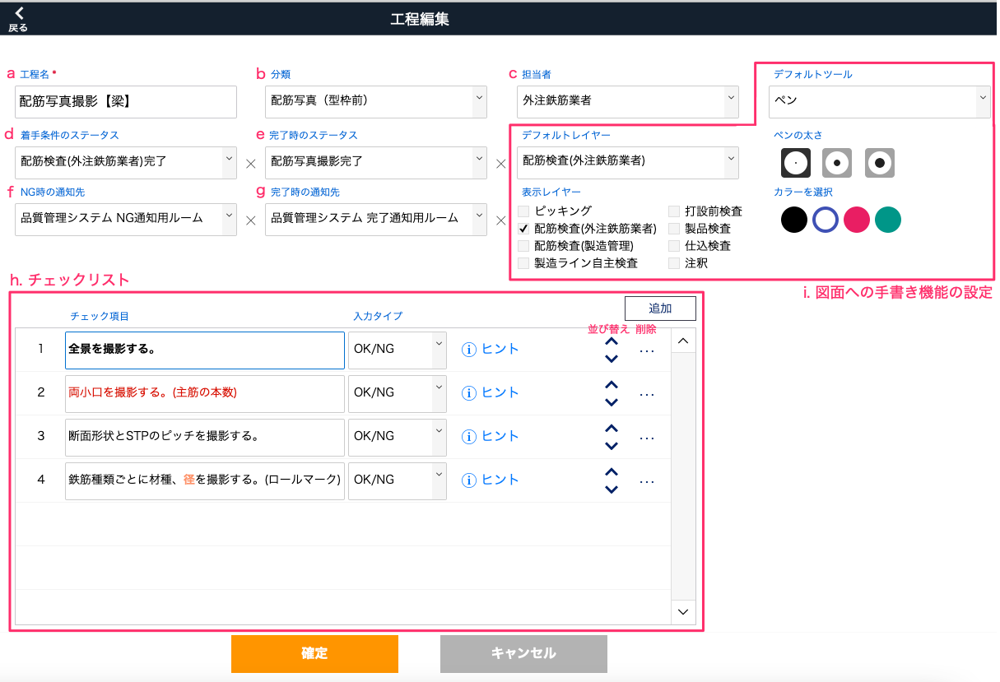

# 工程の各項目詳細

<table><tr><td>

</td></tr></table>

a. [工程名]

工程名を設定します。  
例) 配筋写真撮影【梁】

 
b. [分類]

工程のカテゴリを設定します。  
工程のチェック項目(後述h.)が全て「OK」または「スキップ」のとき完了状態となり、工程の状況を確認する指標となります。  
(項目設定：[品質管理システム_分類マスタ]())  
例) 配筋写真(型枠前)

 
c. [担当者]

工程の担当者を設定します。  
設定された担当者は工程一覧画面や集計画面に表示され、担当者で絞り込みできるようになります。  
例) 外注鉄筋業者

    
担当者項目を編集する

    担当者名を編集したり新規追加することができます。
     
     
    1. [担当者]欄を選択します。
     
     
    2. 担当者一覧末尾の「編集…」を選択します。
     
    <table><tr><td>
    
    </td></tr></table>
     
     
    3. 担当者名を編集します。各行の内容が担当者名になります。
     
    <table><tr><td>
    
    </td></tr></table>
     
     
    4. 編集が完了したら「OK」を選択します。
     
     
    5. 一覧に編集した[担当者名]が表示されます。
     
     

d. [着手条件のステータス]

現在のステータスが着手条件のステータスと同じまたは着手条件のステータスよりも進んでいる場合に、チェック項目のチェックが可能になります。  
(項目設定：[基幹システム_製造ラインステータス]())  
例) 配筋検査(外注鉄筋業者)完了

 
e. [完了時のステータス]

工程のチェック項目(後述h.)が全て「OK」または「スキップ」になった際、現在のステータスが完了時のステータス未満の場合に完了時のステータスに更新されます。  
(項目設定：[基幹システム_製造ラインステータス]())  
例) 配筋写真撮影完了

 
f. [NG時の通知先]

チェック項目でNGが発生した際、設定した<a href="https://go.chatwork.com/ja/" target="_blank">Chatwork</a>のチャットに通知を送ります。  
(項目設定：[品質管理システム_通知マスタ]())  
例) 品質管理システム NG通知通知用ルーム

 
g. [完了時の通知先]

工程のチェック項目(後述h.)が全て「OK」または「スキップ」になった際、設定したChatworkのチャットに通知を送ります。  
(項目設定：[品質管理システム_通知マスタ]())  
例) 品質管理システム 完了通知用ルーム

 
h. [チェックリスト]

工程の作業のチェック項目を設定できます。作業者はチェック項目と製品の状況を照らし合わせて、要件をクリアできているか、どのような不備が発生しているかを、判定や状況写真を以って報告します。チェックリストの作成者は、チェックの手がかりとなる画像や動画のリンクを添付したり、文言の装飾でより注意すべきポイントを示したりすることができます。

    
作業者が見る画像参考

    品質管理システム：製品 > 製品一覧 > 製品詳細 > チェックリスト
     
    <table><tr><td>
    
    </td></tr></table>

- 追加：チェック項目を新規追加します。
- 入力タイプ：チェック判定の選択肢をYes/NoまたはOK/NGから選択します。
- ヒント：チェックの手がかりとなるテキスト、画像、動画のリンクを追加できます。
- チェック項目：チェック内容を記述します。右クリックで文字色、スタイル、フォントなどの編集ができます。例) 全景を撮影する

※FileMaker Goの場合、以下の制約があります。

    iOS でサポートされていないフォントは、サポートされているフォントに変換されます。
    FileMaker Go では、太字、斜体、下線、単語下線、二重下線、タイトル、大文字、小文字、字消し線のテキストスタイルを表示できます。
    FileMaker Go では、強調表示、字間狭く、字間広く、スモールキャップ、上付き、下付きはサポートされていません。

 
i. [図面への手書き機能の設定]

図面を登録すると、図面上のレイヤー(画層。積み重ねられた透明なフィルムのようなもの)に書き込みをすることができます。レイヤーは全部で　「ピッキング、配筋検査(外注鉄筋業者)、配筋検査(製造管理)、製造ライン自主検査、打設前検査、製品検査、仕込検査、注釈」の8枚があります。  
各設定は初期設定で、書き込み時に変更可能です。

- デフォルトレイヤー：チェックリストから図面を開いたときに書き込み対象になっているレイヤーです。（非表示時でも書き込まれます）
- 表示レイヤー：チェックリストから図面を開いたときのレイヤーの表示/非表示を設定します。
- デフォルトツール：レイヤーに書き込むツールをペンかマーカーに設定します。マーカーはペンより透明度が高く、幅が広くなります。

<table><tr><td>

</td></tr></table>

(実際の作業画面：品質管理システム_製品_製品一覧_製品詳細_チェックリスト_図面)