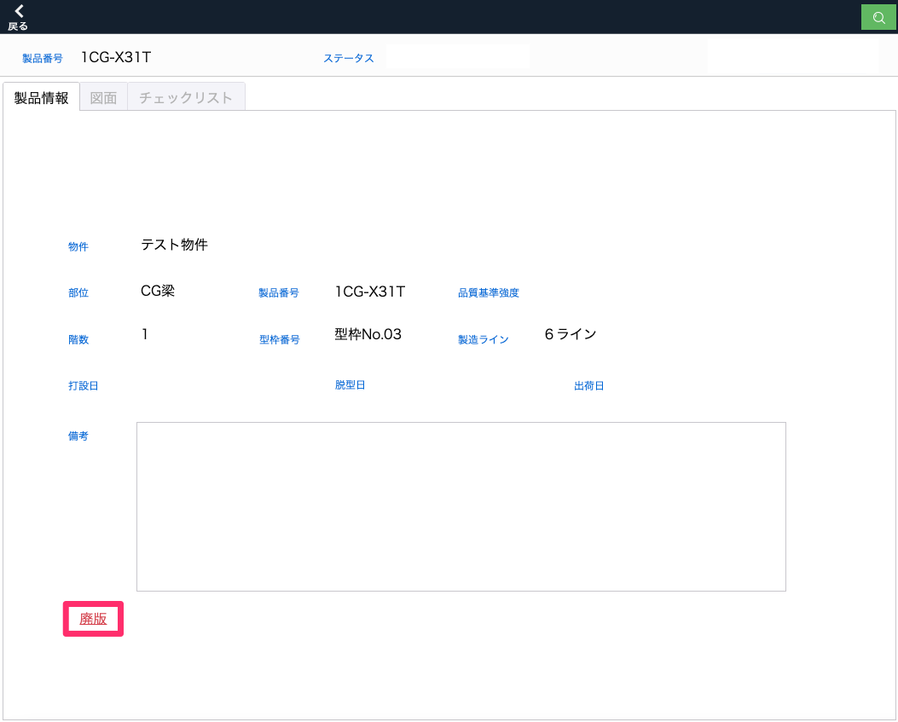
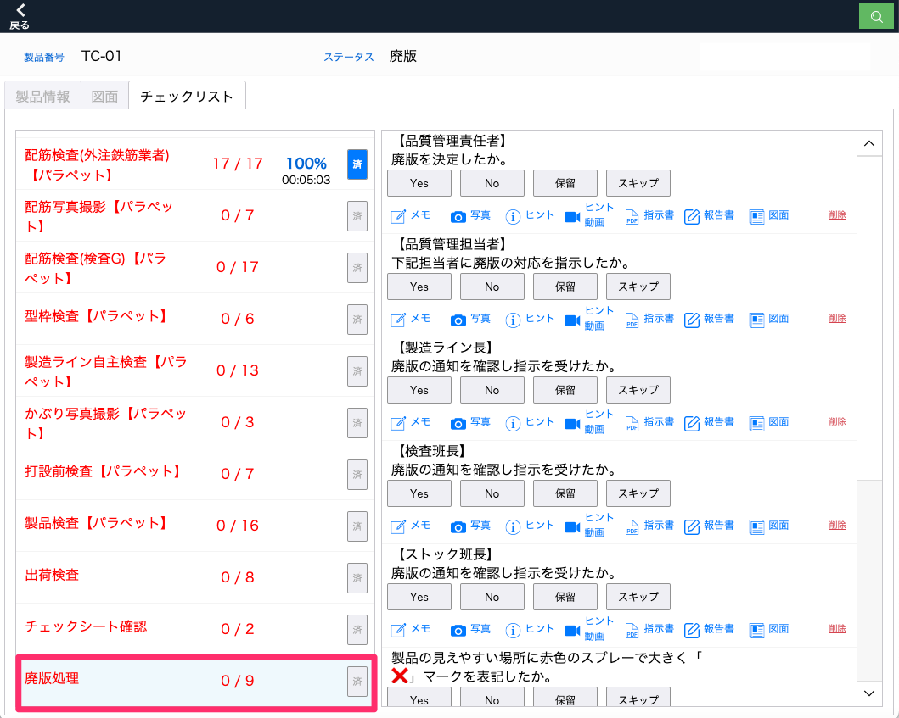
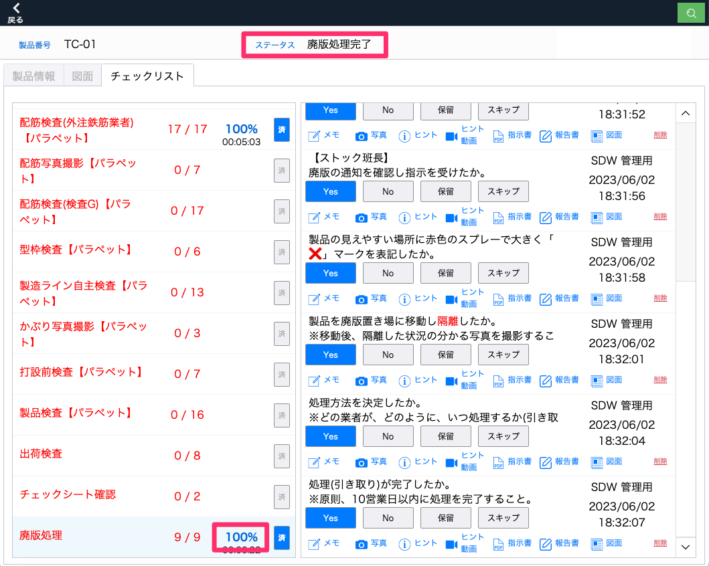

# 製品を廃版にする

1. [製品一覧]画面から[物件]等の条件を設定して表示する製品を絞り込みます。

1. 一覧から製品を選択します。

1. 「製品情報」タブを開き「廃版」を選択します。

    <table><tr><td>
    
    </td></tr></table>

1. 廃版にすると、製品のステータスが廃盤になり、チェックリストに[廃版処理]の工程が追加されます。

    <table><tr><td>
    
    </td></tr></table>

1. [廃版処理]工程が全て完了するとステータスが[廃版処理完了]となります。

    <table><tr><td>
    
    </td></tr></table>