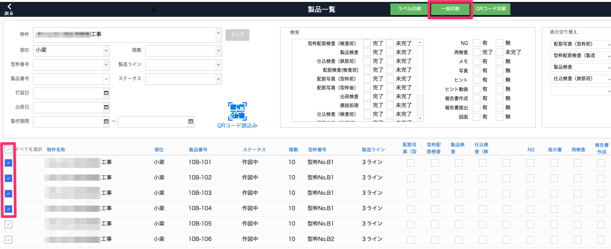
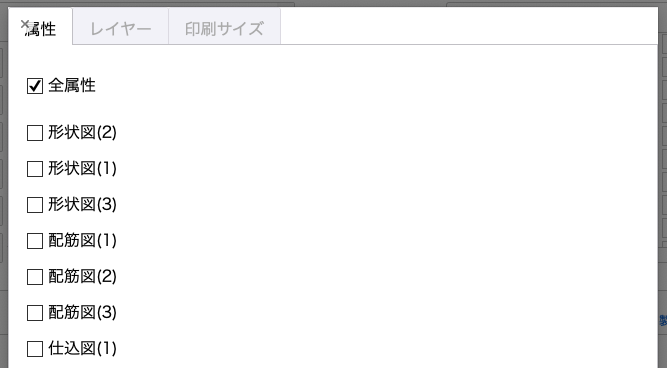
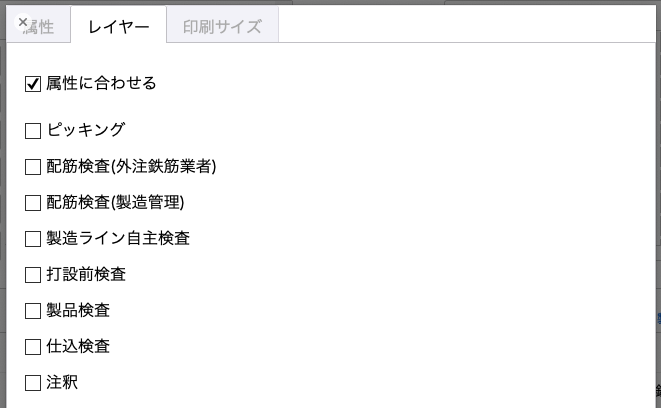
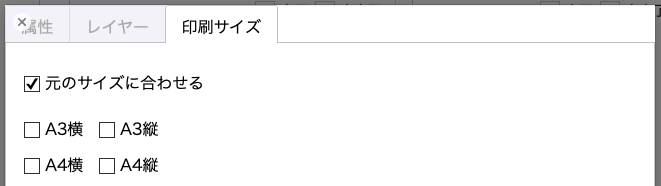
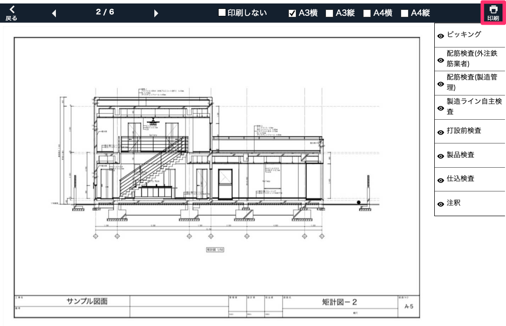
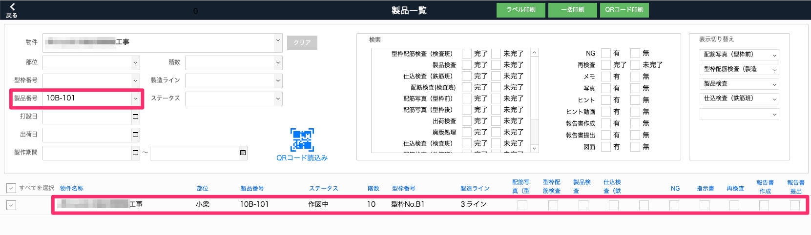
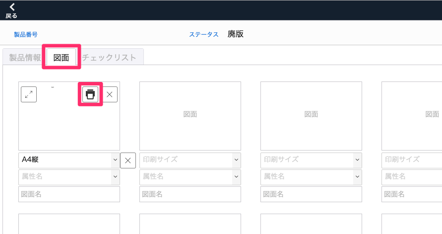

# 製品の図面を印刷する

 

    
一括印刷

     
    1. 「品質管理システム」トップ画面から「製品」を選択します。
     
    <table><tr><td>
    
    </td></tr></table>
     
     

    2. [製品一覧]で印刷したい図面が登録されている製品を検索してチェックボックスにチェックを入れるか全てを選択し、「一括印刷」を選択します。
     
    <table><tr><td>
    
    </td></tr></table>
     
     

    3. 印刷設定をします。
     
     
    ・「属性」タブ
     
    印刷したい図面を属性で絞り込みます。(項目設定：品質管理システム_図面属性マスタ)
     
     
    [全属性]：製品に登録されている図面を全て印刷します。
     
    その他の属性：指定した属性の図面を絞り込みます。(複数選択可)
    <table><tr><td>
    
    </td></tr></table>
     
     

    ・「レイヤー」タブ
     
    図面の印刷したいレイヤーを選択します。(「プレビュー」画面でも切替可能)
     
    <table><tr><td>
    
    </td></tr></table>
     
    [属性に合わせる]：図面属性に紐づけられたレイヤーが印刷されます。図面属性が未設定の図面は全レイヤーが印刷されます。
     
    その他のレイヤー：図面属性に関わらず選択しているレイヤーが印刷されます。(複数選択可)
     
     
    ・「印刷サイズ」タブ
     
    図面を印刷するサイズを選択します。(「プレビュー」画面でも変更可能)
     
    <table><tr><td>
    
    </td></tr></table>
     
    [元のサイズに合わせる]：登録されている図面のpdfファイルの用紙サイズで印刷されます。
     
    その他のサイズ：元の用紙サイズに関わらず、選択したサイズで印刷されます。
     
     
    4. 「プレビュー」を選択します。
     
     
    5. 図面ごとに印刷の要否、用紙サイズ、レイヤーの表示/非表示を確認し、「印刷」を選択します。
     
    <table><tr><td>
    
    </td></tr></table>
     
     
    6. プリンターの設定を確認し、印刷します。
     
     

    
個別印刷

     
    1. 「品質管理システム」トップ画面から「製品」を選択します。
     
    <table><tr><td>
    
    </td></tr></table>
     
     

    2. [製品一覧]で印刷したい図面が登録されている製品を検索して選択します。
     
    <table><tr><td>
    
    </td></tr></table>
     
     

    3. 製品詳細の「図面」タブ内の図面の印刷ボタンを選択します。
     
    <table><tr><td>
    
    </td></tr></table>
     
     

    4. 用紙サイズ、レイヤーの表示/非表示を確認し、「印刷」を選択します。
     
    <table><tr><td>
    
    </td></tr></table>
     
     

    5. プリンターの設定を確認し、印刷します。
     
     

