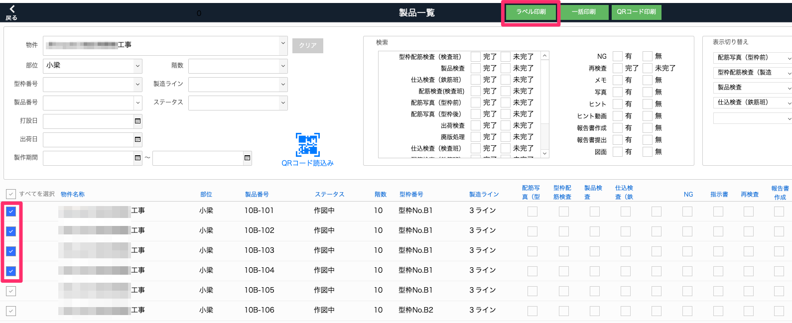
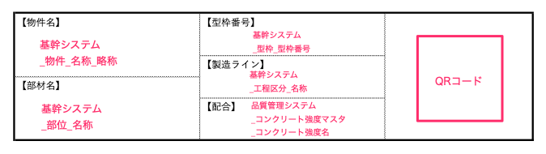

# 製品のラベルを印刷する（専用のラベルプリンター）

### ラベルのQRコードを作業者がiPadで読み取り、製品のチェックリストにスムーズにアクセスできるようになります。

{: .warning }
ラベルの印刷には専用のラベルプリンター（Bepop本体とBepop PC EX、プリンタドライバのインストール）が必要になります。また、事前準備としてCドライブ直下にBepopExportという名前でフォルダを作成しておきます。

1. [品質管理システム]トップ画面から「製品」を選択します。

    <table><tr><td>
    
    </td></tr></table>

1. [製品一覧]でラベル印刷したい製品を検索してチェックボックスにチェックを入れるか全てを選択し、「ラベル印刷」を選択します。

    <table><tr><td>
    
    </td></tr></table>

    ラベル内容

    - 物件名
    - 部材名
    - 型枠番号
    - 製造ライン
    - 配合
    - QRコード

    <table><tr><td>
    
    </td></tr></table>

1. Bepop Exが自動的に起動します。Bepop Exから印刷を行います。