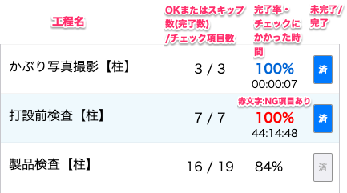

# 工程の状況を確認する

### 品質管理システム：製品 > [製品一覧]から製品を選択し、「チェックリスト」タブから各工程の状況を確認します。

<table><tr><td>

</td></tr></table>

- パーセンテージ：工程の完了率
    
    赤文字：NG項目あり
    
    青文字：完了済み。チェック項目が全て「OK」または「スキップ」
    
    黒文字：未完了
    
- パーセンテージ下の時間：チェックにかかった時間(チェックリスト内の最初の更新から最終更新の時間を記録)
- 済マーク：青色→完了済み　灰色→未完了