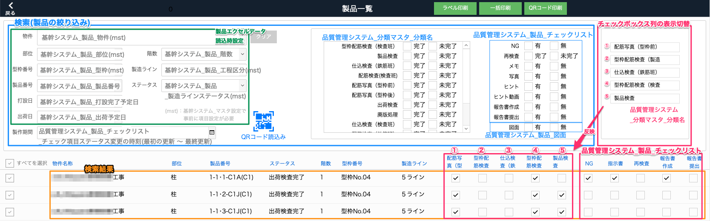
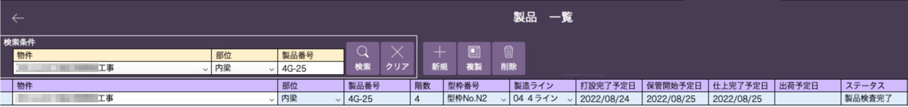
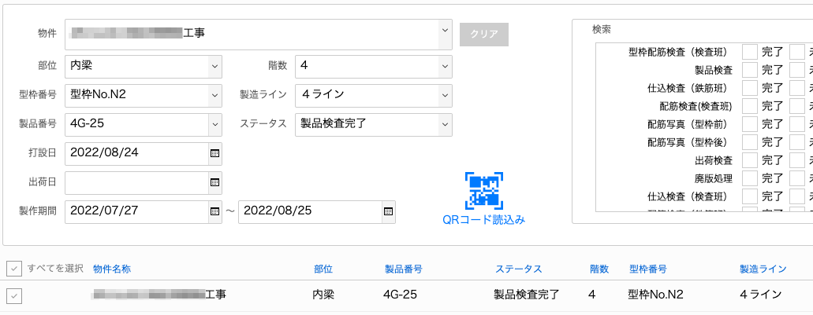

# 各製品の状況を確認する（製品一覧画面）

<table><tr><td>

</td></tr></table>

- 検索：製品情報、分類、チェックリストの項目での絞り込み
- チェックボックス列の表示切替：分類された工程の状況を元にしたチェックボックスの表示切替および並び順の設定
- 検索結果：絞り込んだ製品の情報、分類された工程の状況、チェックリスト内の各項目の有無を表示

1. 基幹システム_製品の情報を元に検索欄で選択、入力して製品を絞りこみます。
    例)
    <table><tr><td>
    
    </td></tr></table>

    ↓

    <table><tr><td>
    
    </td></tr></table>

1. 必要があれば分類ごとの状況、チェックリストの内容でさらに絞り込みます。