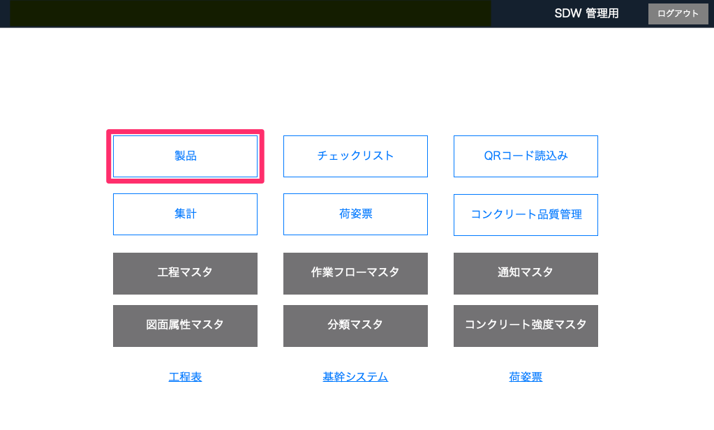
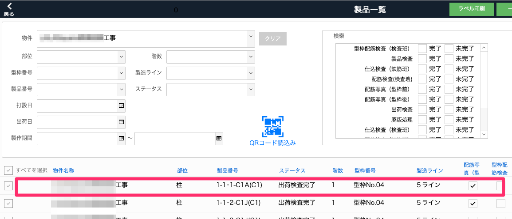
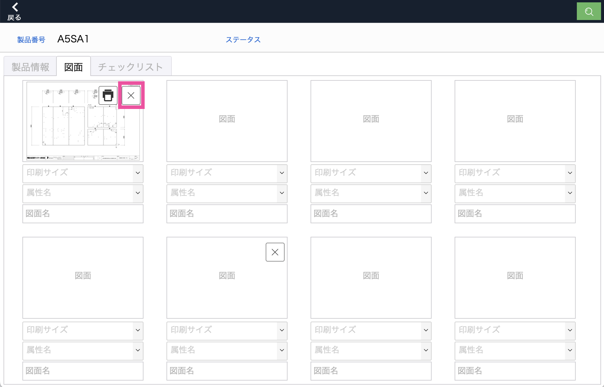
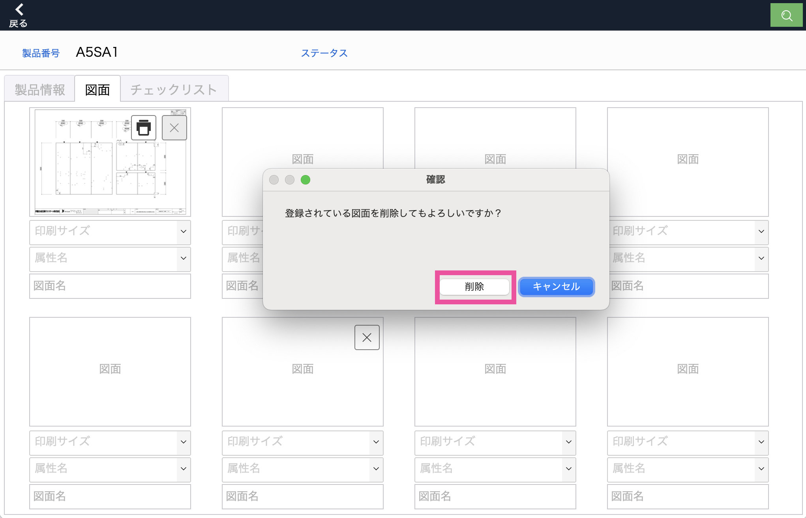

# 製品の図面を削除する

1. [品質管理システム]トップ画面から「製品」を選択します。
    
    <table><tr><td>
    
    </td></tr></table>

1. [製品一覧]画面でQRコードを読み込むか検索し、図面を削除したい製品を選択します。

    <table><tr><td>
    
    </td></tr></table>

1. 製品詳細から「図面」タブを開き、削除したい図面の「✖️」をクリックします。

    <table><tr><td>
    
    </td></tr></table>

1. 確認メッセージで、「削除」をクリックすると完了します。

    <table><tr><td>
    
    </td></tr></table>

{: .note }
図面の登録は[製品登録]()を参考に行ってください。