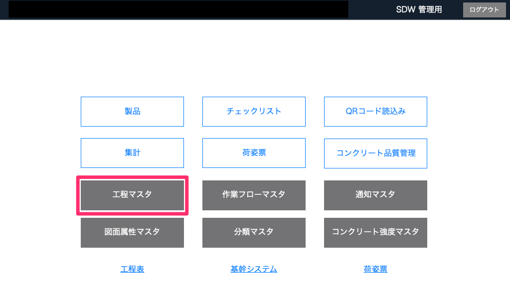

# 工程のテンプレート作成

### 作業フローに登録するための工程のテンプレートを作成します。工程はチェック項目の集まりで、作業フローは工程の集まりです。工程のテンプレートを作成しておくことで、作業フローの作成が簡単に行えるようになります。

<table><tr><td>

</td></tr></table>

1. [品質管理システム]トップ画面から「工程マスタ」を選択します。

    <table><tr><td>
    
    </td></tr></table>

1. [工程一覧]画面から「新規作成」を選択します。

    <table><tr><td>
    
    </td></tr></table>

1. [工程編集]画面で各項目の設定をします。  
    設定内容については[工程の各項目詳細]()を参考にしてください。

    <table><tr><td>
    
    </td></tr></table>

1. 編集が完了したら「確定」を選択します。

1. 工程一覧に工程が追加されます。