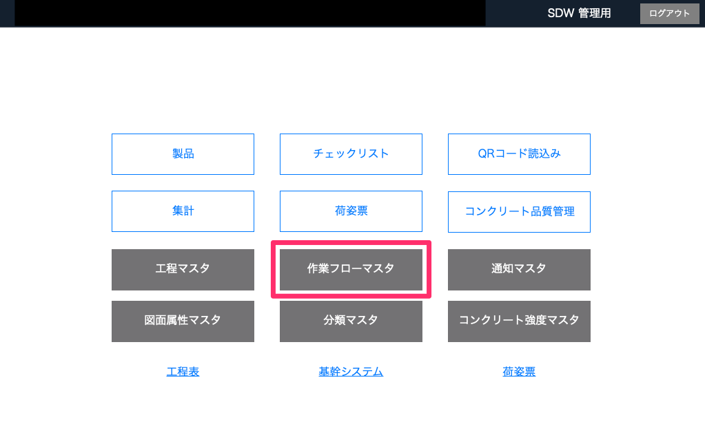
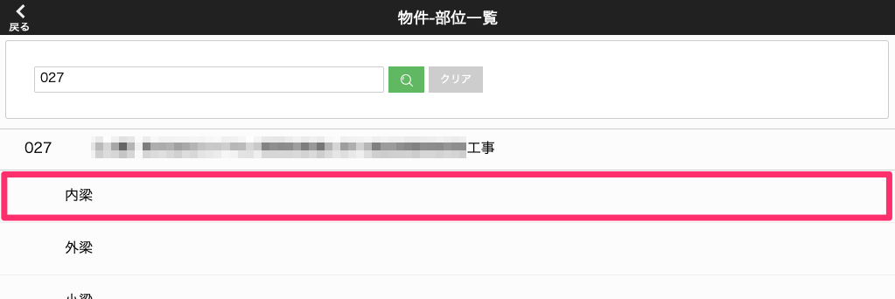
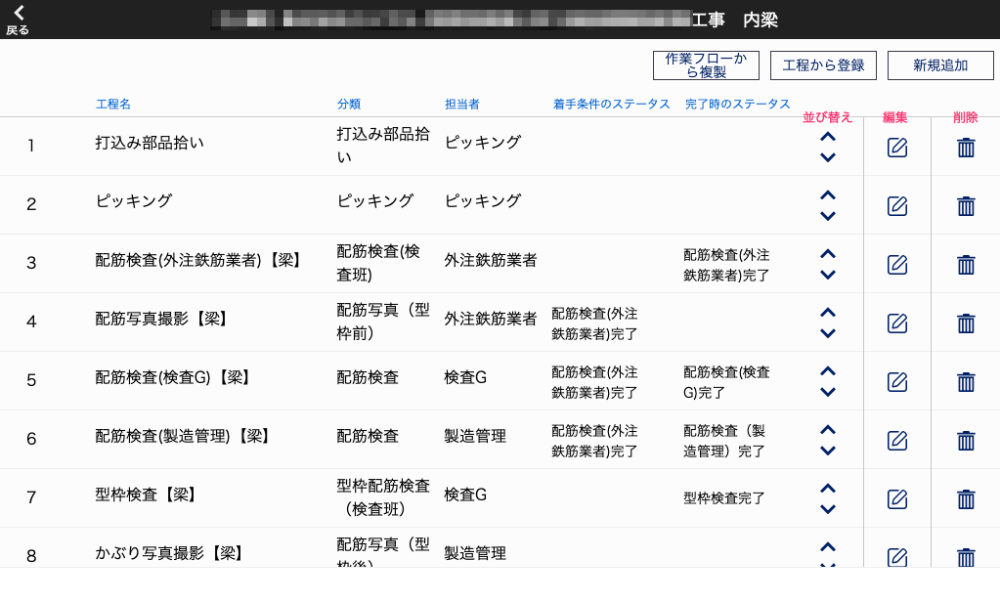
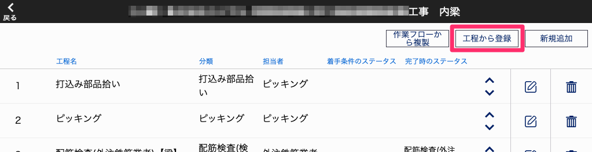
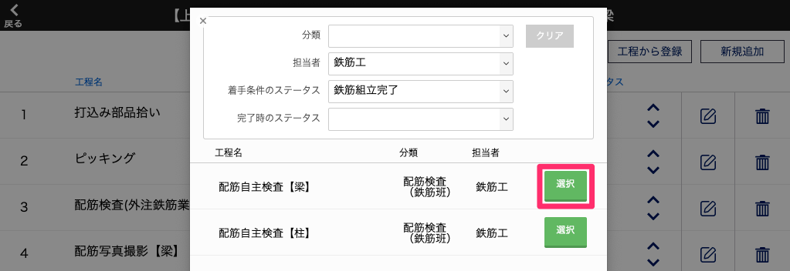
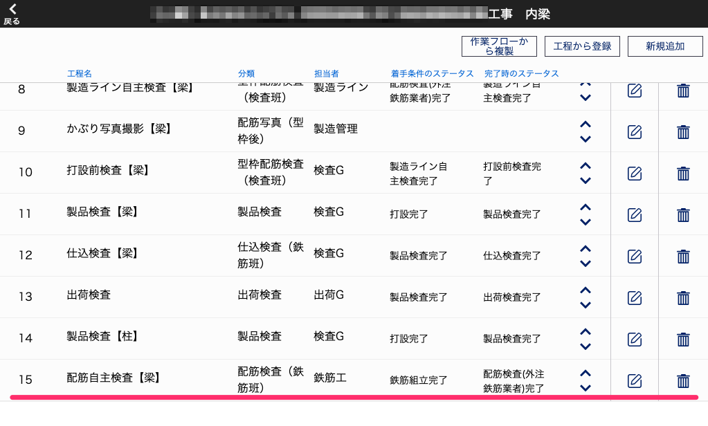
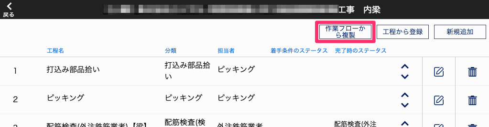
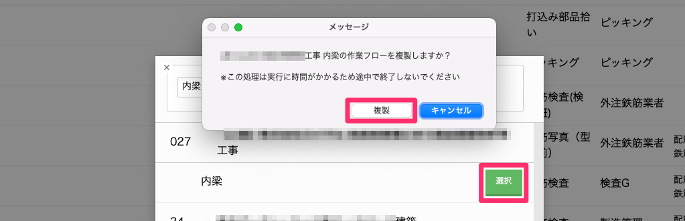
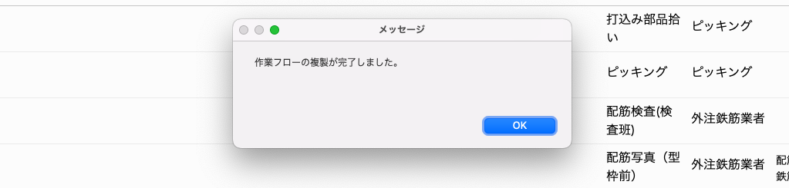
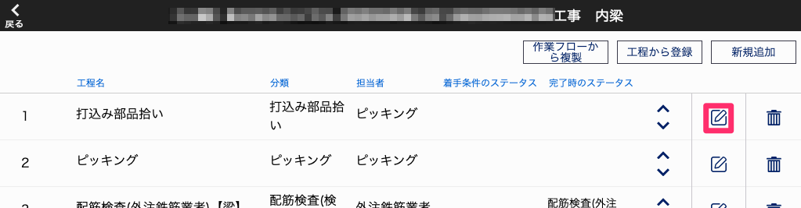

# 作業フロー（製品のチェックリスト）を作成する

### 作業フローに登録した工程が製品のチェックリストとなります。作業フローは物件-部位毎に設定することができ、工程マスタの工程から登録したり、他の作業フローから複製したりすることができます。

{: .warning }
「作業フローマスタ」で作成・編集した工程は「工程マスタ」には反映されません。

    
「工程マスタ」で作成した工程のテンプレートを使用する場合

     
    1. [品質管理システム]トップ画面から「作業フローマスタ」を選択します。
     
    <table><tr><td>
    
    </td></tr></table>
     
     

    2. 作業フローを作成したい物件のコード、物件名称、部位名称のいずれかを[物件-部位一覧]画面の検索欄に入力し、検索ボタンかEnterキーを押して検索します。
     
    <table><tr><td>
    
    </td></tr></table>
     
     

    3. 検索結果に表示された部位を選択すると、部位に割り当てられた工程が作業順で表示されます。これが作業フローになります。
     
    <table><tr><td>
    
    </td></tr></table>
     
     

    4. 「工程から登録」を選択します。
     
    <table><tr><td>
    
    </td></tr></table>
     
     

    5. 登録元にしたい工程の分類、担当者、着手条件・完了時のステータスをプルダウンメニューから選択し、Enterキーを押して絞り込みます。
     
    <table><tr><td>
    
    </td></tr></table>
     
     
    6. 絞り込み結果から工程を[選択]します。
     
     
    7. 作業フローの末尾に作成した工程が追加されます。
     
    <table><tr><td>
    
    </td></tr></table>
     
     

    
既存の作業フローを使用する場合

     
    1. [品質管理システム]トップ画面から「作業フローマスタ」を選択します。
     
    <table><tr><td>
    
    </td></tr></table>
     
     

    2. 作業フローを作成したい物件のコード、物件名称、部位名称のいずれかを[物件-部位一覧]画面の検索欄に入力し、検索ボタンかEnterキーを押して検索します。
     
    <table><tr><td>
    
    </td></tr></table>
     
     

    3. 検索結果に表示された部位を選択すると、部位に割り当てられた工程が作業順で表示されます。これが作業フローになります。
     
    <table><tr><td>
    
    </td></tr></table>
     
     

    4. 「作業フローから複製」を選択します。
     
    <table><tr><td>
    
    </td></tr></table>
     
     
    5. 登録元にしたい作業フローをもつ物件のコード、物件名称、部位名称のいずれかを検索欄に入力し、Enterキーを押して検索します。
     
    <table><tr><td>
    
    </td></tr></table>
     
     
    6. 絞り込み結果から当該工程を[選択]します。
     
    　※この処理は実行に時間がかかるため、途中で終了しないでください。
    　
     
     
    7.「作業フローの複製が完了しました」というメッセージが出たら複製完了です。作業フローの末尾に登録元の作業フローが追加されます。
     
    <table><tr><td>
    
    </td></tr></table>
     
     

    
工程を新規作成する場合

     
    新規作成する方法は工程のテンプレートを作成 2〜を参照してください。また、その際「工程名」を「作業名」に読み替えてください。
     
     

    
工程を編集する

     
    1. 編集したい工程の鉛筆マークを選択します。
     
    <table><tr><td>
    
    </td></tr></table>
     
     

    2. 工程のテンプレートを作成を元に編集します。
     
     
    3. 「確定」を選択します。
     
     

